# 🎯 **Data Scientist Portfolio**  
🌟 Welcome to my **Data Scientist Portfolio** repository! 🚀  
This is a curated collection of my work, showcasing my expertise in **data analysis, machine learning, and visualization**.  
Each project reflects my ability to extract meaningful insights, develop predictive models, and present data-driven solutions effectively.

---

## 📌 **Table of Contents**  
- [🌟 About Me](#-about-me)  
- [🚀 Projects](#-projects)  
- [🛠 Skills](#-skills)  
- [⚙ Tools & Technologies](#-tools--technologies)  
- [💼 Work Experience](#-work-experience)  
- [🎓 Education](#-education)  
- [🎯 Activities](#-activities)  
- [🔧 How to Use This Repository](#-how-to-use-this-repository)  
- [📞 Contact](#-contact)  

---

## 🌟 About Me  
<a id="-about-me"></a>  
I am a **data scientist** with a passion for solving complex problems using data-driven approaches. I specialize in transforming raw data into actionable insights to drive informed decision-making.  
My expertise includes **statistics**, **machine learning**, **data visualization**, and **big data processing**. I am constantly learning and adapting to new technologies to improve my analytical skills and broaden my knowledge in the data science field.

### 📊 **Key Expertise:**  
- **Data Wrangling & Cleaning**  
- **Exploratory Data Analysis (EDA)**  
- **Machine Learning & Predictive Modeling**  
- **Statistical Analysis & Hypothesis Testing**  
- **Data Visualization & Storytelling**  

---


## 🚀 Projects

---

### 🔹 **1. Developed Hospital Databases from Scratch using Microsoft SQL Server**  
**Duration:** Jan 2024 - Apr 2024

**Objective:**  
To design and implement a scalable relational Hospital database system capable of efficiently managing large volumes of structured data. The system needed to be optimized for performance, with clear data integrity and fast query execution.

**Process:**  
- **Database Design**: Started with analyzing the business requirements to determine the essential entities and their relationships. Created an **Entity-Relationship (ER) Diagram** to visualize the schema.  
- **Normalization**: Applied normalization techniques (up to 3rd Normal Form) to ensure data consistency, reduce redundancy, and improve maintainability.  
- **Table Creation**: Developed tables with primary keys and foreign keys to define relationships between the entities.  
- **Indexing**: Implemented indexing on frequently queried columns to enhance query performance.  
- **Stored Procedures & Triggers**: Wrote stored procedures to automate repetitive tasks like data insertion, updates, and deletions. Triggers were used for enforcing business rules, such as auditing or restricting certain actions.  
- **Performance Optimization**: Used query optimization techniques such as indexing, query refactoring, and minimizing joins to ensure high performance.

**Outcome:**  
- A fully operational relational database system that efficiently manages business data.
- Optimized for high-speed query execution even with large datasets.
- Scalable design that can handle future growth.

**Tools Used:**  
- **Microsoft SQL Server**  
- **T-SQL**

Below are some screenshots from my database, including ER Diagrams, Views, Triggers, and Stored Procedures:

### Database Diagram


### Total Appointments


### Returning Today's Appointments
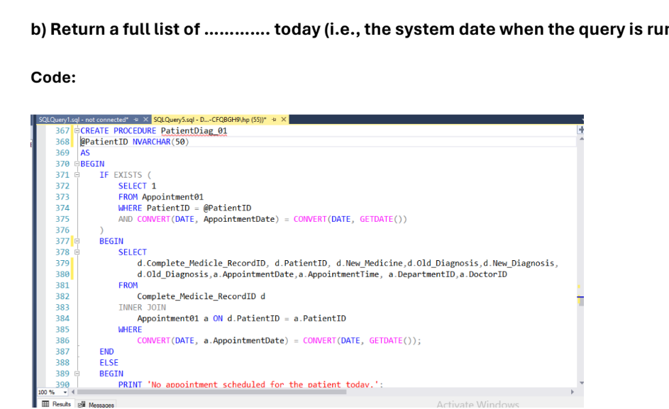

### Updating Doctor Table
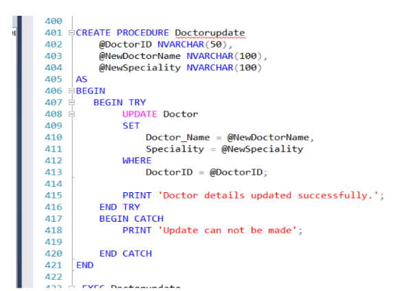

### 🔹 **2. Conducted Statistical Analysis & Advanced Statistics using R**  
**Duration:** Sep 2024 - Dec 2025  
**Dataset:** [Concrete Strength Prediction](https://www.kaggle.com/datasets/ruchikakumbhar/concrete-strength-prediction)  

**Objective:**  
To perform comprehensive statistical analysis on the dataset to uncover insights, identify trends, and support data-driven decision-making. The goal was to understand relationships between variables and provide actionable recommendations to stakeholders.

**Process:**  
1. **Data Cleaning:**  
   - Handled missing values using imputation techniques.  
   - Identified and removed outliers using statistical methods (e.g., IQR, Z-score).  
   - Ensured data consistency by standardizing formats and correcting errors.  

2. **Exploratory Data Analysis (EDA):**  
   - Analyzed variable distributions using histograms, box plots, and density plots.  
   - Explored relationships between variables using scatter plots and correlation matrices.  
   - Identified patterns and trends in the data.  

3. **Hypothesis Testing:**  
   - Conducted t-tests and chi-square tests to validate assumptions and test hypotheses.  
   - Determined statistical significance of findings.  

4. **Regression Analysis:**  
   - Built linear regression models to quantify relationships between independent and dependent variables.  
   - Evaluated model performance using metrics like R-squared and RMSE.  

5. **ANOVA:**  
   - Performed Analysis of Variance (ANOVA) to compare means across groups and identify significant differences.  

6. **Visualization:**  
   - Created clear and informative visualizations using **ggplot2** to communicate insights effectively.  
   - Generated plots such as histograms, scatter plots, and correlation heatmaps.  

**Outcome:**  
- Delivered actionable insights to stakeholders, enabling data-driven decision-making.  
- Provided detailed statistical reports summarizing key findings and trends.  
- Created visualizations and dashboards to present findings in an accessible format.  

**Tools Used:**  
- **R** (ggplot2, dplyr, tidyr, caret, stats)  

### Key Visualizations:
1. **Libraries Used**  
   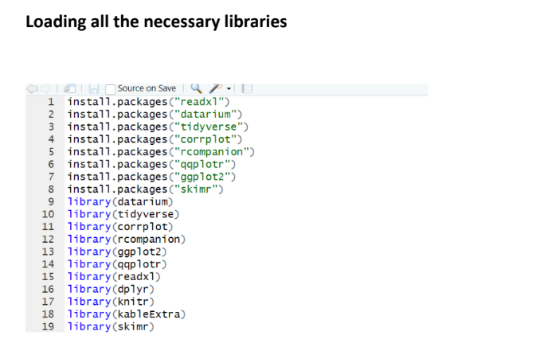  
   - Highlighted the R libraries utilized for analysis.

2. **Numerical Variable Distribution**  
     
   - Analyzed and visualized the distribution of numerical variables.

3. **Categorical Variable Distribution**  
     
   - Explored the distribution of categorical variables.

4. **Correlation Analysis**  
     
   - Created a correlation matrix to identify relationships between variables.

5. **Age Distribution**  
   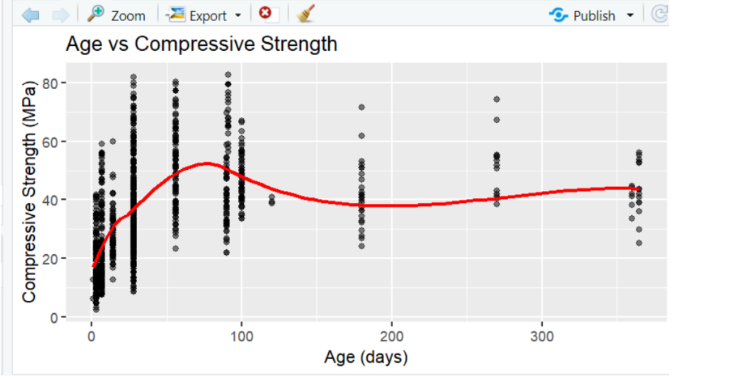  
   - Visualized the distribution of age-related variables.

6. **Simple Linear Regression (SLR) Assumptions**  
     
   - Validated assumptions for regression models.

7. **Regression Model Results**  
     
   - Displayed results and performance metrics of regression models.

8. **Generalized Additive Model (GAM)**  
     
   - Visualized GAM results to capture non-linear relationships.

     

  
### 🔹 **3. Built Time Series Forecasting Models in R**  
**Duration:** Nov 2024 - Dec 2024  
**Dataset:** [Vital Statistics in the UK](https://www.ons.gov.uk/peoplepopulationandcommunity/populationandmigration/populationestimates/datasets/vitalstatisticspopulationandhealthreferencetables)  
**Code:** [Vital Statistics in the UK - Time Series Modelling](https://github.com/mananabbasi/Time-Series-Modelling/blob/main/Birth_time_series.R)
**Objective:**  
To develop accurate time series forecasting models for predicting future trends, enabling stakeholders to optimize business strategies.

**Process:**  
1. **Data Preparation**:  
   - Collected and cleaned historical time series data.  
   - Ensured stationarity using transformations (e.g., differencing).  

2. **Model Selection**:  
   - Evaluated **ARIMA**, **SARIMA**, and **ETS** models for accuracy.  

3. **Model Evaluation**:  
   - Used **RMSE** and **MAE** to measure model performance.  
   - Performed cross-validation to ensure robustness.  

4. **Visualization**:  
   - Created visualizations to compare predicted vs actual values.  

**Outcome:**  
- Delivered accurate forecasts for future trends.  
- Optimized inventory management and decision-making processes.  

**Tools Used:**  
- **R** (forecast, tseries, ggplot2)  

**Key Visualizations:**  
1. **Time Series Plot**  
   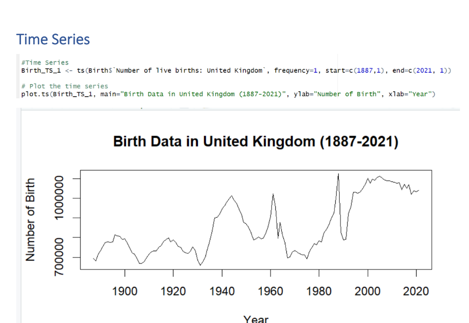
2. **Additive Model with Trend**  
   
2. **Partial Cologram**  
   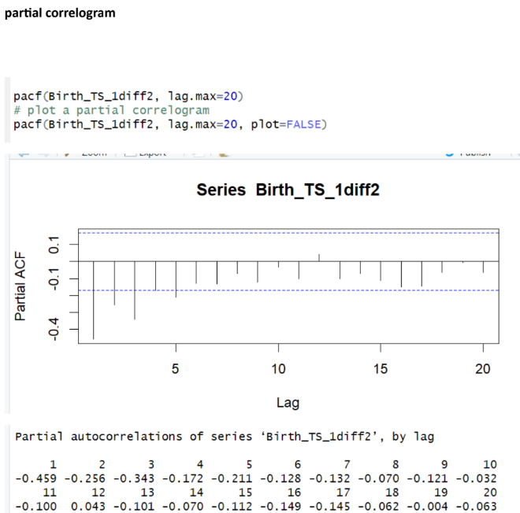
   
4. **Forecasting Results**  
     
5. **Forecast Errors**  
   

 
 
---

### 🔹 **4. Power BI Dashboard: Real-Time Insights by Region and Country Group**  
**Duration:** Jan 2024 - Current  
**Dataset:** [World Population Prospects 2024](https://population.un.org/wpp/)  
**Other Dashboards:** [GitHub Repository](https://github.com/mananabbasi/Dashboard-Power-bi)  

**Objective:**  
To create dynamic, interactive dashboards for real-time monitoring of business performance, enabling stakeholders to track KPIs and make data-driven decisions.

**Process:**  
1. **Data Integration**:  
   - Integrated SQL databases, Excel files, and APIs for consistent, real-time data.  
2. **Dashboard Design**:  
   - Designed user-friendly dashboards with interactive slicers and filters.  
3. **Advanced Analytics**:  
   - Used **DAX** to create calculated measures, columns, and KPIs.  
4. **Performance Optimization**:  
   - Optimized dashboards for fast load times with large datasets.  
5. **Real-Time Updates**:  
   - Configured live data connections for real-time insights.  

**Outcome:**  
- Delivered interactive dashboards for real-time performance monitoring.  
- Enabled stakeholders to make timely, data-driven decisions.  

**Tools Used:**  
- **Power BI**, **DAX**, **SQL**  

**Key Visualizations:**  
1. **Final Dashboard**  
     
2. **Global Population Trends (1960–2022)**:  
   - Visualized total population growth across regions.  
   - Highlighted urbanization trends (urban vs. rural population shifts).  


### 🔹  **5 Classification Models in Python for Banking  
**Duration:** Sep 2024 - Present  

**Objective:**  
Developed ML models to predict client subscription to term deposits using a banking dataset.  

**Dataset:**  
[Bank Marketing Dataset](https://archive.ics.uci.edu/dataset/222/bank+marketing)  
**Code:**  
- [KNN Classification](https://github.com/mananabbasi/Machine-Learning-and-Data-Mining-/blob/main/KNN%20-%20Classification%20with%20Class%20Imbalance.ipynb)  
- [Decision Tree Classification](https://github.com/mananabbasi/Machine-Learning-and-Data-Mining-/blob/main/Classification%20Decision_Tree%20with%20class%20imbalance.ipynb)  

**Process:**  
- Preprocessed data: cleaned, scaled, and encoded categorical variables using **Pandas** and **Scikit-learn**.  
- Built **classification models** (Logistic Regression, Random Forest, SVM) and **clustering models** (K-Means, DBSCAN).  
- Evaluated models using accuracy, precision, recall, F1 score, and silhouette score.  
- Tuned hyperparameters with **GridSearchCV** and **RandomizedSearchCV**.  

**Outcome:**  
- Delivered accurate predictive models and identified customer behavior patterns.  

**Tools:** Python, Scikit-learn, Pandas, Matplotlib  

**Key Visualizations:**  
 **Data Exploration Visualizations:**  
-       

 **Model Performance Visualizations:**  
-   
-   


**Actionable Recommendations:**  
1. **Model Preference:** Use Decision Tree over KNN for better performance.  
2. **Key Feature:** Focus on call duration (Feature 12) as it significantly impacts subscription likelihood.  
3. **Customer Profile:** Target college-educated, married individuals aged 30-40 in management roles.  
4. **Timing:** Mid-month (around the 15th) and summer months (May, July, August) are optimal for campaigns.  
5. **Contact Strategy:** Prioritize mobile phone contact and ensure impactful first interactions.  

---

# 🔹  **6  Customer Segmentation Using K-Means and Hierarchical Clustering on Credit Card Data  
**Duration:** Sep 2024 - Present  

## **Objective**  
Developed machine learning models for customer segmentation using clustering techniques on credit card marketing data to identify distinct customer groups and tailor marketing strategies.  

## **Dataset**  
[Credit Card Marketing Dataset](https://www.kaggle.com/datasets/arjunbhasin2013/ccdata?resource=download)  

## **Code**  
- [K-Means Clustering](https://github.com/mananabbasi/Machine-Learning-and-Data-Mining-/blob/main/ClusteringK-Means.ipynb)  
- [Hierarchical Clustering](https://github.com/mananabbasi/Machine-Learning-and-Data-Mining-/blob/main/Dendogram_Clustring.ipynb)  

## **Process**  
1. **Data Import:**  
   - Utilized **PySpark RDDs** and **DataFrames** to import and process large datasets in a distributed environment.  
2. **Data Transformation:**  
   - Cleaned, aggregated, and transformed data using **Spark SQL** and **DataFrame APIs**.  
3. **Optimization:**  
   - Optimized processing pipelines using **partitioning, caching,** and **parallel processing** for faster data handling.  
4. **Big Data Processing:**  
   - Handled large datasets that couldn't be processed by traditional systems, enabling real-time analytics and insights.  
5. **Visualization:**  
   - Leveraged **Databricks notebooks** to visualize data for deep analysis and insights.  

## **Outcome**  
- Developed scalable pipelines for analyzing large datasets, enabling real-time insights.  
- Improved decision-making speed through enhanced data analysis efficiency.  

## **Tools Used**  
- Python  
- Scikit-learn  
- Pandas  
- Matplotlib  

---

## **Key Visualizations**  

1. **Correlation Analysis**  
     

2. **Dendrogram**  
     

3. **Dendrogram Clusters**  
   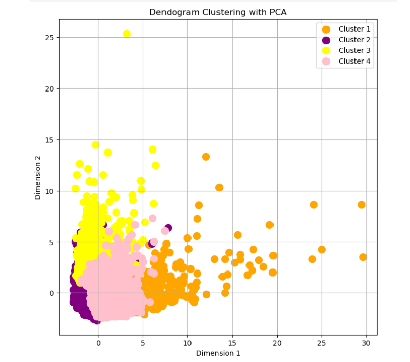  

4. **Elbow Method**  
     

5. **Feature Analysis**  
   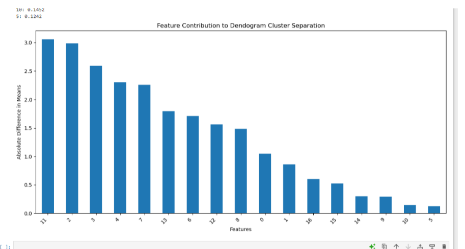  

6. **K-Means Clustering**  
   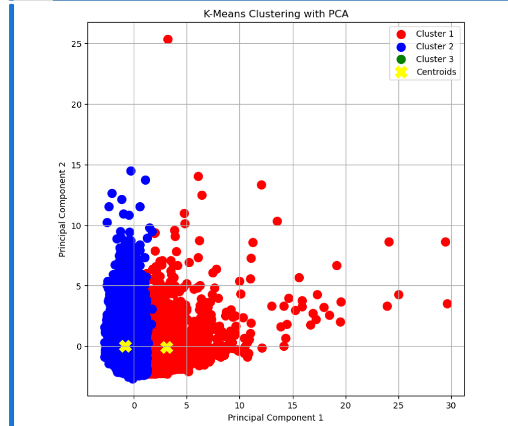

---

## **Actionable Recommendations**  

### **Key Insights from Model Evaluations**  
1. **K-Means (2 Clusters):**  
   - Provides a broad categorization of customers, ideal for simple segmentation.  

2. **Hierarchical Clustering (4 Clusters):**  
   - Offers more detailed insights for targeted marketing strategies.  

3. **CASH_ADVANCE Feature:**  
   - Key in separating clusters.  
   - **High Cash Advance Users:** Offer competitive rates or rewards to encourage responsible usage.  
   - **Low Cash Advance Users:** Promote educational campaigns on cash advance benefits.  

### **Key Insights from EDA**  
1. **Low Credit Limit (<1,000):**  
   - **Low Usage, High Credit Limit:** Use promotional offers to encourage higher credit utilization.  
   - **High Usage, Low Credit Limit:** Consider raising credit limits to enhance satisfaction and spending.  

---
### 🔹 **7. Sentiment Analysis and Text Classification on US McDonald's Reviews Dataset**  
**Duration:** Sep 2024 - Present  

**Objective:**  
Developed ML models to analyze sentiment and classify customer reviews from McDonald's US stores.

**Dataset:**  
[US McDonald's Stores Reviews Dataset](https://www.kaggle.com/datasets/nelgiriyewithana/mcdonalds-store-reviews)  

**Code:**  
- [Sentiment Analysis and Text Classification](https://github.com/mananabbasi/Machine-Learning-and-Data-Mining-/blob/main/Sentimental_Analysis_and_Text_Classification_on_MacDonalds_Dataset.ipynb)

**Process:**  

**Data Preprocessing:**  
- Cleaned dataset: handled missing values, removed duplicates, standardized text (lowercased, removed special characters).  
- Tokenized and lemmatized text using **NLTK** and **TextBlob**.  
- Encoded categorical variables and scaled numerical features using **Pandas** and **Scikit-learn**.  

**Feature Engineering:**  
- Extracted features: word frequencies, n-grams, sentiment scores (positive, negative, neutral) with **TextBlob** and **TF-IDF**.  
- Applied **PCA** for dimensionality reduction.  

**Model Development:**  
- Built classification models (Logistic Regression, Random Forest, SVM) for sentiment classification (positive, negative, neutral).  
- Implemented clustering models (K-Means, DBSCAN) to group reviews and identify themes.

**Outcome:**  
- Delivered effective sentiment analysis and text classification models, revealing customer sentiment and key review patterns.

**Tools Used:**  
- Python  
- **Scikit-learn**  
- **Pandas**  
- **Matplotlib**  
- **NLTK** (Natural Language Toolkit)  
- **TextBlob** (for sentiment analysis)

  
## **Key Visualizations**  

### **Overall Sentiments**  
1. **Overall Sentiment Distribution**  
     

### **Positive Sentiments**  
2. **Positive Reviews Analysis**  
     
3. **Most Common Positive Words**  
   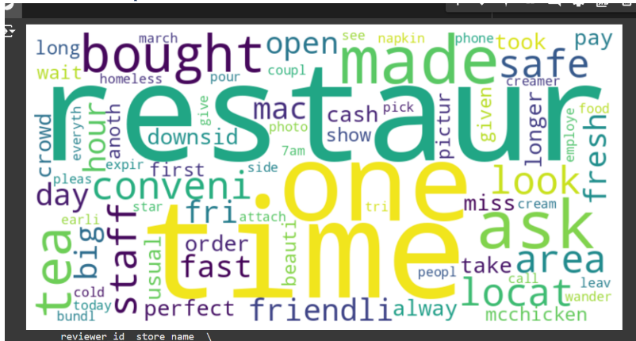  

### **Negative Sentiments**  
4. **Most Common Negative Words**  
   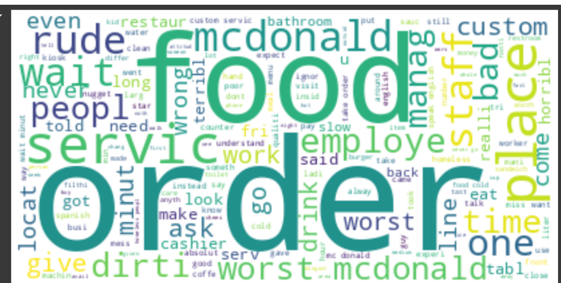  
5. **Negative Reviews Analysis**  
   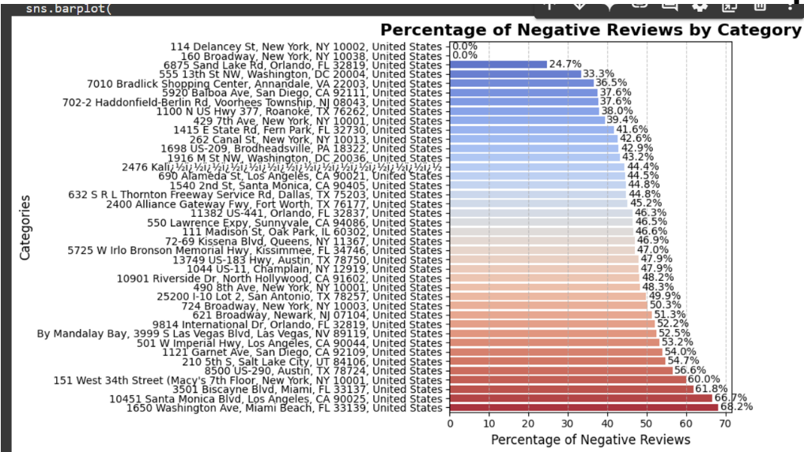  
6. **Negative Word Cloud**  
     


**Actionable Recommendations:**  

**Text Classification Insights:**  
- McDonald's can use a text classification model to gain a clearer understanding of customer sentiment and promptly address both positive and negative feedback.  
- Review distribution: 48.1% of customers gave 4–5-star ratings, 37.5% gave 1–2-star ratings, and 14.4% gave 3-star ratings.

**Sentiment Analysis Insights:**  
- McDonald's stores in New York (114 Delancey St and 160 Broadway) are receiving the best feedback, while the Miami Beach store (1650 Washington Ave) is underperforming.  
- Focus on improving food quality and service speed at the Miami Beach location to address its challenges and enhance customer satisfaction.


### 🔹 **8. Classification Models on Azure ML Designer**  
**Duration:** Sep 2024 - Present 

Dataset:
[Banking Dataset](https://archive.ics.uci.edu/dataset/222/bank+marketing)

Code:
https://github.com/mananabbasi/Azure-ML-Designer


# Process: Building a Classification Model in Azure ML Designer

1. **Upload Data**  
   Import the Banking Dataset into Azure ML Studio.

2. **Clean & Split Data**  
   Clean the data and handle missing values. Split data into training (70-80%) and testing (20-30%) sets.

3. **Select Model**  
   Choose a classification algorithm (e.g., Logistic Regression, Decision Tree, Random Forest, SVM).

4. **Train Model**  
   Train the model using the training dataset.

5. **Evaluate Model**  
   Generate predictions and evaluate using metrics like accuracy, precision, and recall.

6. **Tune Hyperparameters (Optional)**  
   Optimize the model using hyperparameter tuning.

7. **Deploy Model (Optional)**  
   Deploy the model as a web service for real-time predictions.

**Outcome:**  
- Successfully built and evaluated classification models using Azure ML Designer. Achieved accurate predictions for client subscription likelihood, enabling targeted marketing strategies , Demonstrated the ability to leverage cloud-based tools for scalable and efficient machine learning workflows..

## Tools Used:
- **Azure ML Studio**
- **Azure ML Designer**
- **Logistic Regression**
- **Decision Tree**
- **Random Forest**
- **Support Vector Machine (SVM)**
- **Data Cleaning & Preprocessing Modules**
- **Hyperparameter Tuning**
- **Model Evaluation Metrics (Accuracy, Precision, Recall)**


## Key Visualizations:

1. **Decision Tree and Random Forest Comparison**  
   


2. **Logistic Regression Performance**  
   


3. **Decision Tree Evaluation**  
   


### 🔹 **9. DATABRICKS Projects Using PYspark (RDD , Dataframes and SQL)**  
**Duration:** Jan 2024 - Present 

**Objective:**  
To process and analyze large-scale datasets efficiently using **PySpark** on the **Databricks** platform. The aim was to handle big data challenges and create scalable, optimized data pipelines.


**Process:**  
- **Data Import**: Used PySpark's **RDDs (Resilient Distributed Datasets)** and **DataFrames** for importing and processing large datasets across distributed systems.  
- **Data Transformation**: Performed data cleaning, aggregation, and transformation tasks using Spark SQL and DataFrame APIs.  
- **Optimization**: Optimized data processing pipelines for performance, reducing processing time significantly by leveraging partitioning, caching, and parallel processing.  
- **Big Data Processing**: Processed datasets too large for traditional systems, providing real-time insights and analytics for business needs.  
- **Visualization**: Visualized processed data using integrated Databricks notebooks for in-depth analysis.

**Outcome:**  
- Created scalable data processing pipelines that allowed the analysis of massive datasets, providing insights in real-time.  
- Improved data analysis efficiency, enabling faster decision-making for data-driven business strategies.

**Tools Used:**  
- **PySpark**  
- **Databricks**, **Apache Spark**

---

## 🛠 Skills  
<a id="-skills"></a>  
Here is a list of my key technical and soft skills.

### **Technical Skills:**  
- **Programming Languages**: Python, R, SQL  
- **Machine Learning**: Classification, Regression, Clustering, Deep Learning  
- **Big Data & Cloud**: Spark, Hadoop, AWS, GCP  
- **Data Visualization**: Power BI, Tableau, Matplotlib, Seaborn  
- **Statistical Analysis**: Hypothesis Testing, ANOVA, Regression Analysis  

### **Soft Skills:**  
- **Problem Solving**  
- **Communication**  
- **Collaboration**  
- **Adaptability**  
- **Critical Thinking**

---

## ⚙ Tools & Technologies  
<a id="-tools--technologies"></a>  
I am proficient in a range of tools and technologies that help me effectively analyze data and develop insights.

- **Programming Languages**: Python, R, SQL  
- **Libraries/Frameworks**: Pandas, NumPy, Scikit-learn, TensorFlow, PyTorch  
- **Databases**: MySQL, PostgreSQL, MongoDB  
- **Big Data & Cloud**: AWS, Azure, GCP, Hadoop, Spark  
- **Data Visualization**: Power BI, Tableau, Matplotlib, Seaborn  
- **Development Tools**: Jupyter Notebook, VS Code, Git

---

## 💼 Work Experience  
<a id="-work-experience"></a>  
I have gained hands-on experience in various data science roles, where I applied my skills to solve real-world business challenges.

### **Data Visualization Analyst (Part-Time)**  
**Eagle Cars & Tiger Taxis | Oct 2024 - Present | Clitheroe, UK**  
- Created weekly and monthly dashboards to report driver performance.  
- Automated reporting processes, reducing manual reporting time by 50%.  
- Developed visualizations that improved decision-making for stakeholders.

### **Data Scientist (Full-Time)**  
**WebDoc | May 2023 - Dec 2023 | Islamabad, Pakistan**  
- Improved data accuracy by 20% through data cleaning and validation.  
- Created over 15 dynamic visualizations to represent complex datasets.  
- Applied regression and classification models to predict user behavior.

### **Data Insights Analyst (Full-Time)**  
**Zones, IT Solutions | Sep 2021 - May 2023 | Islamabad, Pakistan**  
- Developed data-driven strategies that increased customer retention by 18%.  
- Designed and maintained Power BI dashboards for real-time performance tracking.  
- Collaborated with cross-functional teams to design reports for business decisions.

---

## 🎓 Education  
<a id="-education"></a>  
Here’s my academic background that laid the foundation for my career in data science.

### **M.S. in Data Science** _(Expected May 2025)_  
**University of Salford, UK**  
- Coursework: Machine Learning, Big Data Analytics, NLP, Deep Learning

### **B.S. in Software Engineering** _(Graduated May 2022)_  
**Bahria University, Pakistan**  
- Coursework: AI, Data Mining, Web Development, Database Systems

---

## 🎯 Activities  
<a id="-activities"></a>  
In addition to my professional and academic pursuits, I am actively involved in extracurricular activities.

### **President, Dawah Society - Salford University** _(2024)_  
- Organized weekly social events to foster student engagement and unity.

---

## 🔧 How to Use This Repository  
<a id="-how-to-use-this-repository"></a>  
Clone this repository to explore my projects and codebase:  
```bash
git clone https://github.com/your-username/data-scientist-portfolio.git  
cd data-scientist-portfolio

## 📞 Contact
<a id="-contact"></a>
You can get in touch with me through the following channels:

📧 Email: your.email@example.com
🔗 LinkedIn: Your LinkedIn Profile
🐙 GitHub: Your GitHub Profile
