# 🎯 Data Scientist Portfolio  
🌟 Welcome to my Data Scientist Portfolio! 🚀  
A showcase of my work in data analysis, machine learning, and visualization, highlighting my ability to extract insights and build data-driven solutions.

---

## 📌 Table of Contents

- [🌟 About Me](#about-me)  
- [🛠 Skills](#skills)  
- [⚙ Tools & Technologies](#tools--technologies)  
- [🚀 Projects](#projects)  
  - [Dissertation](#dissertation)
    - [1. Introduction](#1-introduction)
    - [2. Datasets Used](#2-datasets-used)
    - [3. Cryptocurrency Trends and Global Adoption](#3-cryptocurrency-trends-and-global-adoption)  
      - [Conducting Statistical Testing to Check Impact of Events on Bitcoin Price](#conducting-statistical-testing-to-check-impact-of-events-on-bitcoin-price)
    - [4. Social Media Sentiment and Behavioral Insights: Analyzing Bitcoin Tweets (2021–2023)](#4-social-media-sentiment-and-behavioral-insights-analyzing-bitcoin-tweets-20212023)  
      - [Minibatch K-Means Clustering Algorithm](#minibatch-k-means-clustering-algorithm)
      - [Sentiment Analysis](#sentiment-analysis)
    - [5. Influencer Users' Tweets on Cryptocurrency (Feb 2021 – Jun 2023) Tweet Dataset](#5-influencer-users-tweets-on-cryptocurrency-feb-2021--jun-2023-tweet-dataset)  
      - [Topic Modeling: Analyzing Tweet Themes and Engagement](#topic-modeling-analyzing-tweet-themes-and-engagement)
    - [6. Analyzing Bitcoin Price Data (Minute-by-Minute) and Capturing the Trends from 2012 Till 2025](#6-analyzing-bitcoin-price-data-minute-by-minute-and-capturing-the-trends-from-2012-till-2025)  
      - [K-Means Clustering](#k-means-clustering)
    - [7. Combined Analysis of Twitter Sentiment and Bitcoin Market Data](#7-combined-analysis-of-twitter-sentiment-and-bitcoin-market-data)  
      - [Doing Statistical Testing](#doing-statistical-testing)
    - [8. Predictive Modeling Using Combined Sentiment and Bitcoin Price Data](#8-predictive-modeling-using-combined-sentiment-and-bitcoin-price-data)  
      - [Model Selection and Training](#model-selection-and-training)
      - [Non-Linear Models](#non-linear-models)
        - [Model 1: XGBoost Regressor Model](#model-1-xgboost-regressor-model)
        - [Model 2: Random Forest Regressor Model](#model-2-random-forest-regressor-model)
      - [Comparing Both Models](#comparing-both-models)
      - [Model Recommendations](#model-recommendations)
    - [9. Conclusion](#9-conclusion)
  - [Statistical Analysis Projects with R](#statistical-analysis-projects-with-r)  
  - [Advanced SQL Database Development Projects](#advanced-sql-database-development-projects)  
  - [Data Mining & Machine Learning Projects in Python](#data-mining--machine-learning-projects-in-python)  
    - [A. Real-Time Data Classification Models in Python](#a-real-time-data-classification-models-in-python)  
    - [B. Customer Segmentation Using K-Means and Hierarchical Clustering](#b-customer-segmentation-using-k-means-and-hierarchical-clustering)  
    - [C. Sentiment Analysis and Text Classification on Real-Time Datasets](#c-sentiment-analysis-and-text-classification-on-real-time-datasets)  
  - [Classification Models using Azure ML Designer](#classification-models-using-azure-ml-designer)  
  - [Databricks Projects with PySpark](#databricks-projects-with-pyspark)  
  - [Power BI Dashboard Development Projects](#power-bi-dashboard-development-projects)  
  - [Current Projects](#current-projects)  
- [💼 Work Experience](#work-experience)  
- [🎓 Education](#education)  
- [🎯 Activities](#activities)  
- [📞 Contact](#contact)


---

## 🌟 About Me <a name="-about-me"></a>  
I am a data scientist dedicated to solving complex problems using data-driven methods. Specializing in statistics, machine learning, data visualization, and big data processing, I transform raw data into valuable insights. Always eager to learn, I continuously expand my knowledge and adapt to new technologies in the field.

---

## 🛠 Skills <a name="-skills"></a>  

### Technical Skills:  
- **Programming Languages**: Python, R, SQL  
- **Machine Learning**: Classification, Regression, Clustering, Deep Learning  
- **Big Data & Cloud**: Spark, Hadoop, AWS, GCP  
- **Data Visualization**: Power BI, Tableau, Matplotlib, Seaborn  
- **Statistical Analysis**: Hypothesis Testing, ANOVA, Regression Analysis  

### Soft Skills:  
- **Problem Solving**  
- **Communication**  
- **Collaboration**  
- **Adaptability**  
- **Critical Thinking**

---

## ⚙ Tools & Technologies <a name="-tools--technologies"></a>  
I am proficient in a range of tools and technologies that help me effectively analyze data and develop insights.

- **Programming Languages**: Python, R, SQL  
- **Libraries/Frameworks**: Pandas, NumPy, Scikit-learn, TensorFlow, PyTorch  
- **Databases**: MySQL, PostgreSQL, MongoDB  
- **Big Data & Cloud**: AWS, Azure, GCP, Hadoop, Spark  
- **Data Visualization**: Power BI, Tableau, Matplotlib, Seaborn  
- **Development Tools**: Jupyter Notebook, VS Code, Git

---

## 🚀 Projects <a name="-projects"></a>  


### Dissertation <a name="-dissertation"></a>  
A full-scale academic project that explores Bitcoin market behavior, user sentiment, and forecasting trends using a multi-stage data pipeline.

#### 1. Introduction
Background, motivation, objectives, and overall roadmap of the dissertation.

#### 2. Dataset
Details of all datasets used — Twitter, App Adoption, and Bitcoin minute-wise data (2012–2025).

#### 3. Cryptocurrency Trends and Global Adoption
Trends from 2015–2022, global app usage, download spikes, and key event impacts.

##### Conducting Statistical Testing to Check Impact of Events on Bitcoin Price
Using t-tests and event windows to evaluate how key announcements moved prices.

#### 4. Social Media Sentiment and Behavioral Insights: Analyzing Bitcoin Tweets (2021–2023)
Preprocessing, feature extraction, and behavioral clustering of tweets.

##### Minibatch K-Means Clustering Algorithm
Detecting tweet clusters (e.g., memes, analysis, FUD, bullish signals).

##### Sentiment Analysis
Using VADER and TextBlob to derive user sentiment patterns.

#### 5. Influencer Users' Tweets on Cryptocurrency (Feb 2021 – Jun 2023) Tweet Dataset
Tracking popular crypto influencers, tweet timelines, and user engagement.

##### Topic Modeling: Analyzing Tweet Themes and Engagement
LDA modeling to explore key topics and trends within influencer tweets.

#### 6. Analyzing Bitcoin Price Data (Minute-by-Minute) and Capturing the Trends from 2012 Till 2025
Decomposing Bitcoin volatility and trend cycles using clustering.

##### K-Means Clustering
Labeling volatility phases, identifying price regimes and anomaly detection.

#### 7. Combined Analysis of Twitter Sentiment and Bitcoin Market Data
Aligning tweets and price by timestamp to extract correlation patterns.

##### Doing Statistical Testing
Hypothesis tests to validate sentiment-price relationships.

#### 8. Predictive Modeling Using Combined Sentiment and Bitcoin Price Data
Creating models to forecast Bitcoin price using sentiment and historical data.

##### Model Selection and Training
Modeling pipeline using cross-validation and grid search.

##### Non-Linear Models
###### Model 1: XGBoost Regressor Model
Powerful gradient boosting approach for price prediction.

###### Model 2: Random Forest Regressor Model
Bagging ensemble for capturing sentiment-driven volatility.

##### Comparing Both Models
Metric evaluation: RMSE, MAE, and R² comparisons.

##### Model Recommendations
Final suggestions for investors and developers based on results.

#### 9. Conclusion
Key insights, takeaways, and recommendations for future research.


### Statistical Analysis Projects with R <a name="statistical-analysis-projects-with-r"></a>  

#### 🔹 **A. Statistical Analysis & Advanced Statistics using R**  
**Duration:** Sep 2024 - Dec 2025  

🔗 **Dataset:** 
 [Concrete Compressive Strength](https://www.kaggle.com/datasets/ruchikakumbhar/concrete-strength-prediction).
**📂 Github Repository:**  [GitHub Repository](https://github.com/mananabbasi/Applied_Statistics_-_Data_Visualisation_)
**📂 Code File:**  [Code](https://github.com/mananabbasi/Applied_Statistics_-_Data_Visualisation_/blob/main/Statistical%20Analylics%20%20For%20Concrete%20Compressive%20Strength%20Data%20set.R)

**Objective:**  
To perform statistical analysis on the dataset, uncover insights, and support data-driven decision-making by understanding relationships between variables.

**Process:**  
1. **Data Cleaning:** Handled missing values and outliers, ensuring data consistency.  
2. **Exploratory Data Analysis (EDA):** Analyzed distributions and relationships using visualizations.  
3. **Hypothesis Testing:** Conducted t-tests and chi-square tests to validate assumptions.  
4. **Regression Analysis:** Built linear regression models and evaluated performance.  
5. **ANOVA:** Compared means across groups to identify significant differences.  
6. **Visualization:** Created visualizations using **ggplot2** for clear insights.  

**Tools Used:**  
- **R** (ggplot2, dplyr, tidyr, caret, stats, etc.)

#### **📊 Key Visualizations**   
**Numerical Variable Distribution**  
   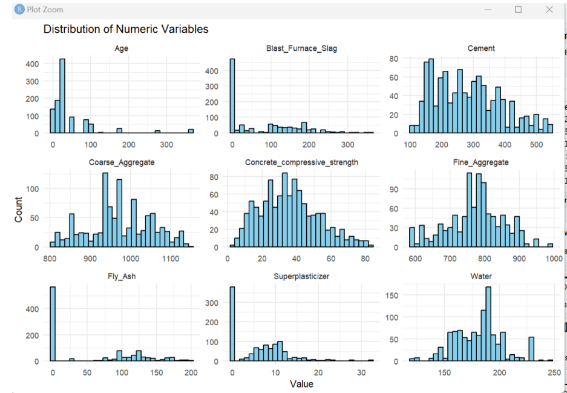  
**Categorical Variable Distribution**  
   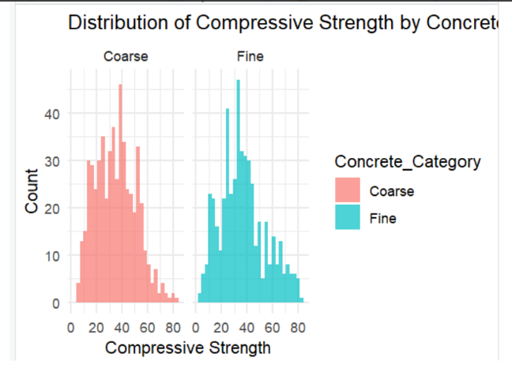  
**Normality Check**  
     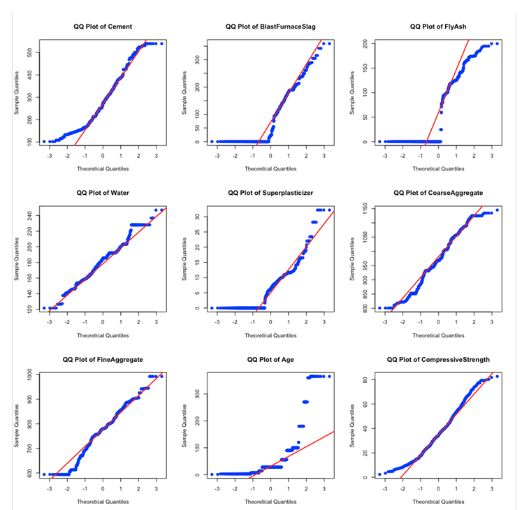
**Correlation Analysis**  
   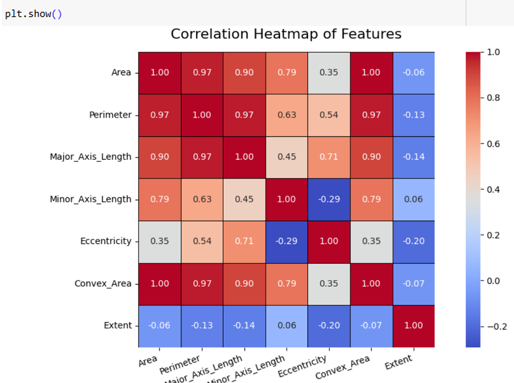  
**Simple Linear Regression (SLR) Assumptions**  
   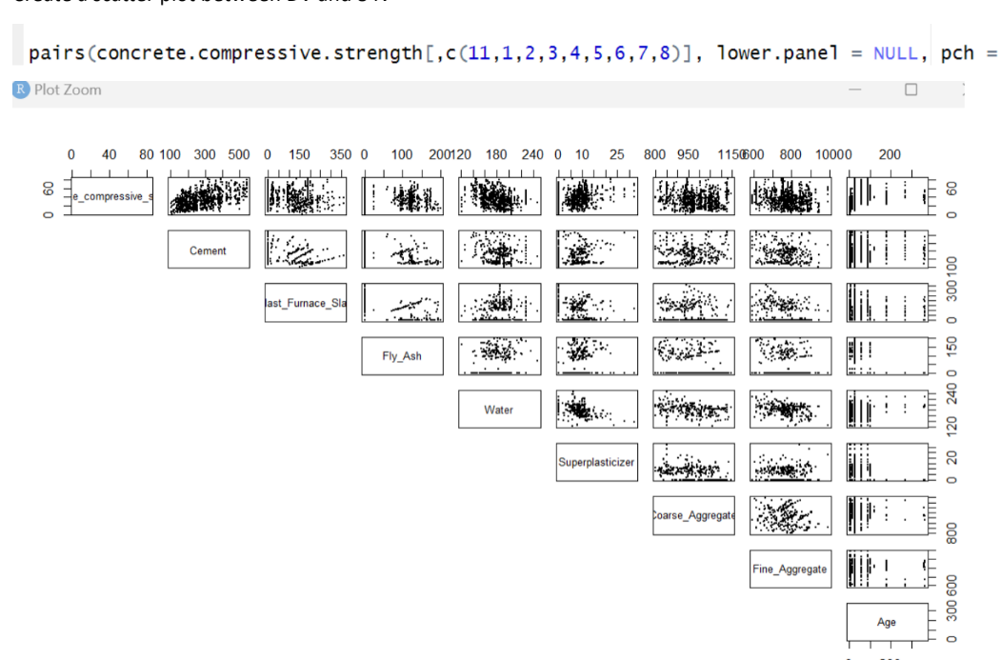  
**Regression Model Results**  
   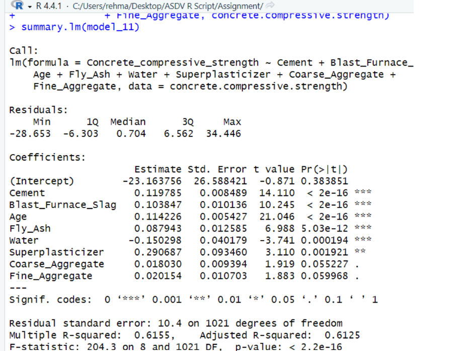  
**Generalized Additive Model (GAM)**  
   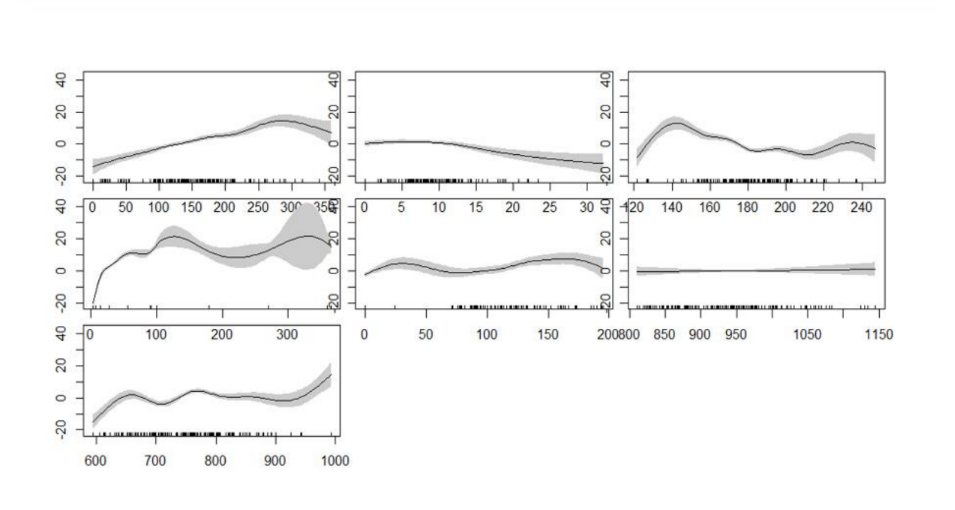  

**Outcome:**  
- Delivered actionable insights and statistical reports to stakeholders.  
- Created visualizations and dashboards for effective communication.

---

#### 🔹 **B. Time Series Forecasting Models in R**  
**Duration:** Nov 2024 - Dec 2024  
🔗 **Dataset:**  [Vital Statistics in the UK](https://www.ons.gov.uk/peoplepopulationandcommunity/populationandmigration/populationestimates/datasets/vitalstatisticspopulationandhealthreferencetables).

**📂 Code File:**  [Vital Statistics in the UK - Time Series Modelling](https://github.com/mananabbasi/Time-Series-Modelling/blob/main/Birth_time_series.R)

**Objective:**  
To develop accurate time series forecasting models for predicting future trends, enabling stakeholders to optimize business strategies.

**Process:**  
1. **Data Preparation:** Collected and cleaned historical time series data.  
2. **Model Selection:** Evaluated **ARIMA**, **SARIMA**, and **ETS** models for accuracy.  
3. **Model Evaluation:** Used **RMSE** and **MAE** to measure model performance.  
4. **Visualization:** Created visualizations to compare predicted vs actual values.

**Tools Used:**  
- **R** (forecast, tseries, ggplot2)

#### **📊 Key Visualizations**   
**Additive Model with Increasing or Decresing Trends**
  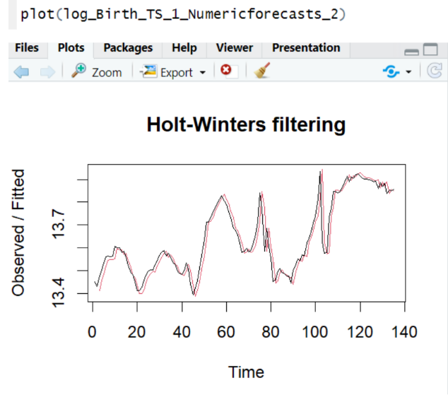
**Forecasting Results**  
   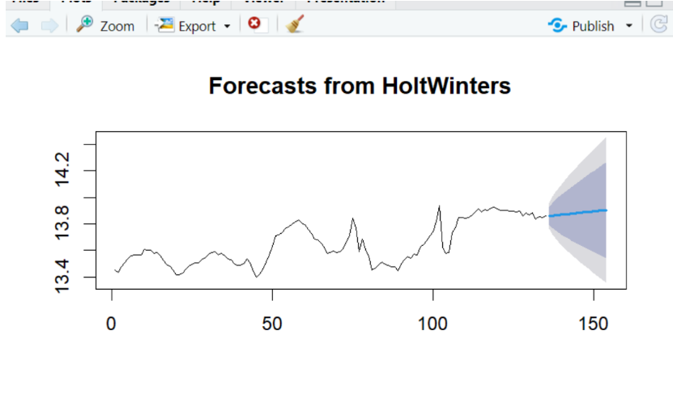  
**Forecast Errors**  
   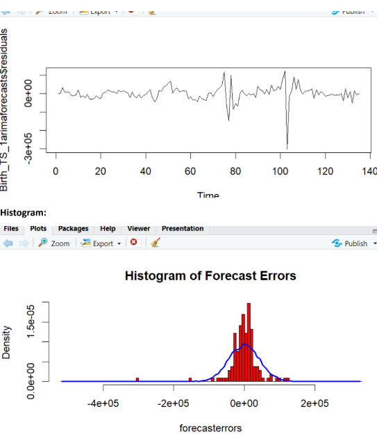  

**Outcome:**  
- Provided actionable insights through thorough EDA and robust regression model evaluation.  
- Significantly improved inventory management efficiency and informed data-driven decision-making.

---
### Advanced SQL Database Development Projects <a name="advanced-sql-database-development-projects"></a>  

#### 🔹 **A. Hospital Database Development (Microsoft SQL Server)**  
**Duration:** Jan 2024 - Apr 2024  
**📂 Code Files:** 
- [Hospital Database](https://github.com/mananabbasi/Data-Science-Project-using-the-3NF-to-create-tables-and-insert-data-using-contrain-using-Advance-SQL/blob/main/%4000752004_task1.sql.sql)
- [Restuarent Database](https://github.com/mananabbasi/Data-Science-Project-using-the-3NF-to-create-tables-and-insert-data-using-contrain-using-Advance-SQL/blob/main/%4000752004_task2.sql.sql)
  
**Objective:**  
Designed and implemented a scalable, high-performance hospital database to manage large volumes of data.

**Process:**  
- Created ER diagrams and normalized the schema.  
- Optimized the database with indexing for fast queries.  
- Automated tasks using stored procedures and triggers to improve efficiency.

**Tools Used:**  
- **Microsoft SQL Server**, **T-SQL**
**Key Visualizations**  

**Database Diagram for Restuarent**  
  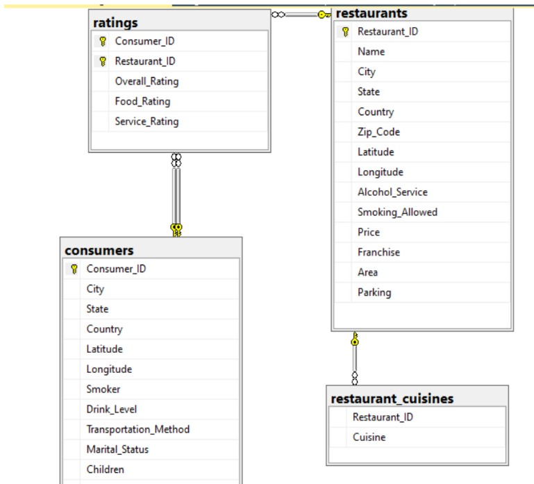
**Database Diagram for Hospiatl**  
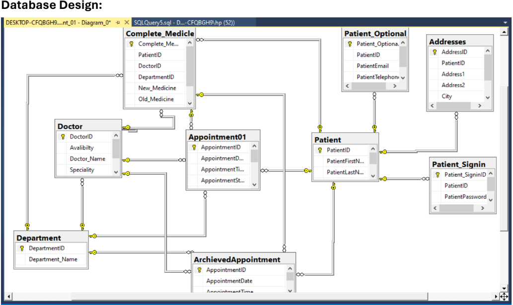
 **Total Appointments** 
The total number of appointments is shown in the following visualization:
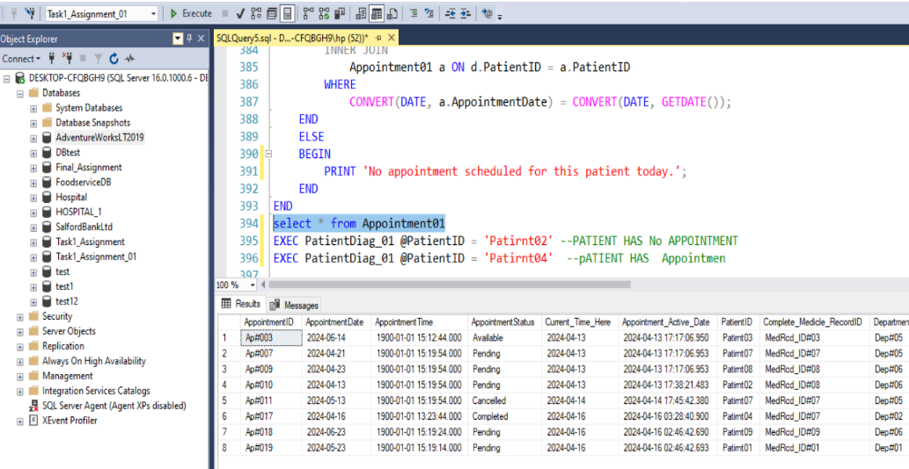

**Outcome:**  
- Developed a fully operational, scalable database system.  
- Optimized for fast queries, improved data integrity, and easy management of hospital data.

---
### Data Mining & Machine Learning Projects in Python <a name="data-mining--machine-learning-projects-in-python"></a>  
---
---

#### 🔹 **A. Real-Time Data Classification Models in Python** <a name="classification-models-in-python"></a>  

**Duration:** Sep 2024 - Present  

**Objective:**  
Developed ML models to predict client subscription to term deposits using real world dataset.

**Process:**  
- Preprocessed data and built **classification** Models (Logistic Regression, Random Forest, SVM, K-Means, DBSCAN).  
- Evaluated models with accuracy, precision, recall, F1, and silhouette scores.  
- Performed hyperparameter tuning using **GridSearchCV** and **RandomizedSearchCV**.

**Outcome:**  
- Delivered accurate predictive models, uncovering customer behavior patterns.

**Tools Used:** Python, Scikit-learn, Pandas, Matplotlib

**📌 1- Classification Models On Banking Datasets:**  

- 🔗 **Dataset:** **[Bank Marketing Dataset](https://archive.ics.uci.edu/dataset/222/bank+marketing)**  
  
**📂 Code Files:**  
- [KNN Classification](https://github.com/mananabbasi/Machine-Learning-and-Data-Mining-/blob/main/KNN%20-%20Classification%20with%20Class%20Imbalance.ipynb)  
- [Decision Tree Classification](https://github.com/mananabbasi/Machine-Learning-and-Data-Mining-/blob/main/Classification%20Decision_Tree%20with%20class%20imbalance.ipynb)

**📊 Key Visualizations from Banking Dataset:**  

**Data Exploration**  
   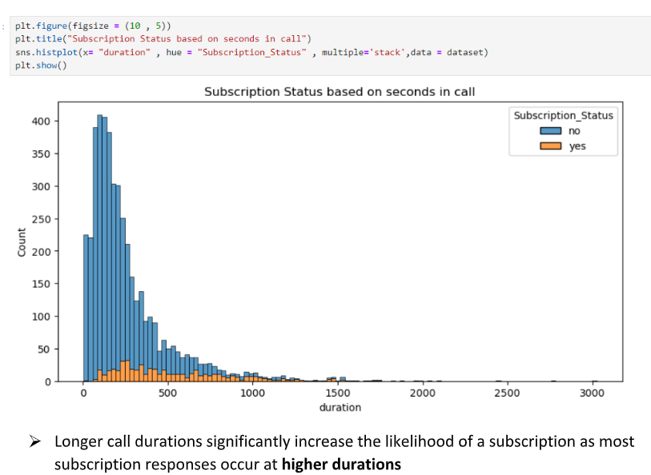

**Model Performance**  
   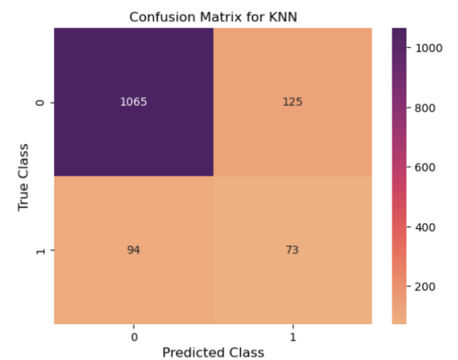  
   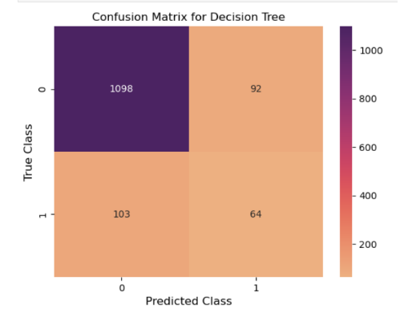
   
**Actionable Recommendations For Banking DataSet:**  
- Use **Decision Tree** over KNN for better performance.  
- Focus on **call duration for Banking dataset** (Feature 12).  
- Target **college-educated, married individuals (30-40)** in **management roles**.  
- Optimal campaign timing: **mid-month** and **summer months**.  
- Prioritize **mobile contact** and impactful first interactions.
  
**📌 2- Classification Models On Agriculture Datasets:**  
- 🔗 **Dataset:** **[Cinar & Koklu (2019) Rice Variety Dataset](https://archive.ics.uci.edu/dataset/545/rice+cammeo+and+osmancik)**
  
**📊 Key Visualizations from Agriculture Dataset:**  
**Data Exploration for Agriculture Dataset**  
   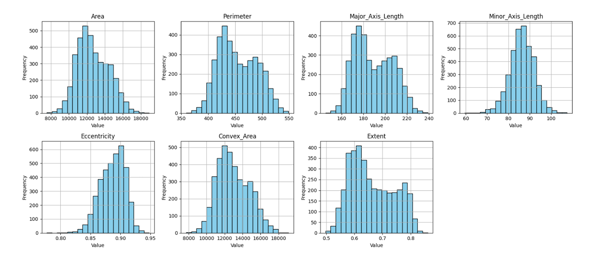

**Model Performance on Agriculture Dataset**  
   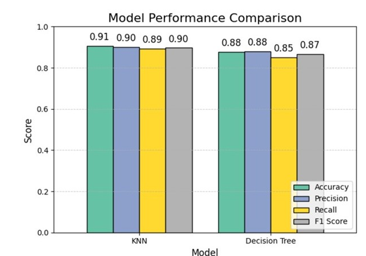

**Actionable Recommendations For Agriculture DataSet:**  
  
-  Implement machine learning models to classify rice varieties, improving accuracy in quality control and sorting.  
-  Use KNN classification insights to optimize rice variety categorization, enhancing inventory management and logistics.
-  Leverage data for better breeding strategies and customized farming techniques, boosting crop yield and quality.


**📌 3- Classification Models on Obesity Dataset**

🔗 **Dataset:** **[Estimation of Obesity Levels Based on Eating Habits and Physical Condition]**(https://archive.ics.uci.edu/dataset/544/estimation+of+obesity+levels+based+on+eating+habits+and+physical+condition)  

**📂 Code Files:**
- [Decision Tree Classifier:](https://github.com/mananabbasi/Machine-Learning-Data-Mining-Extended-Projects/blob/main/Classification_Decision_Tree.ipynb)  
- [K-Nearest Neighbors (KNN) Classifier:](https://github.com/mananabbasi/Machine-Learning-Data-Mining-Extended-Projects/blob/main/Classification_KNN.ipynb)

**📊 Key Visualizations from Obesity Dataset:**  
**Gender Distribution**
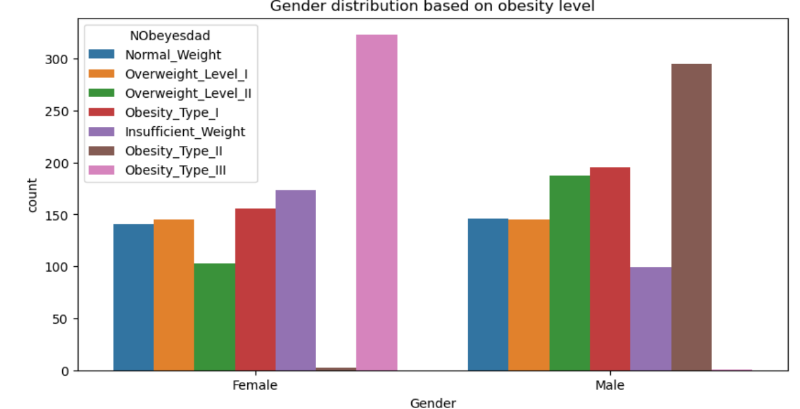  

**Age Distribution**
  

**Confusion Matrix**  
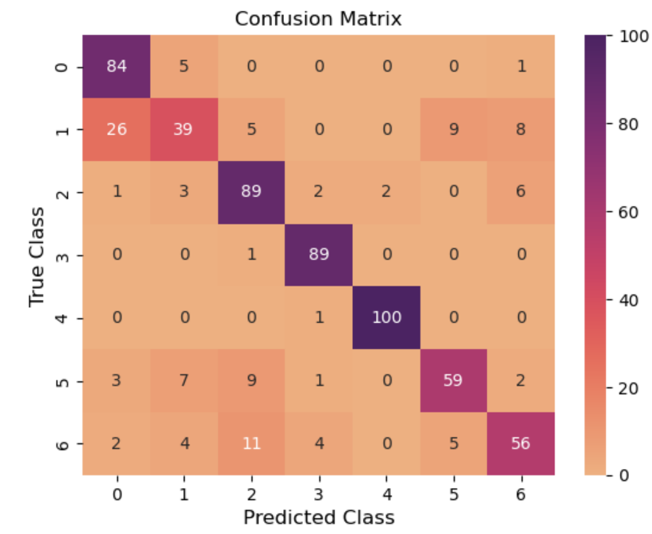   
---

**Actionable Recommendations For Agriculture DataSet:**  
- AI-driven nutrition & fitness programs for better health recommendations.  
- Identify at-risk individuals and collaborate with insurers for prevention.  
- Launch smart health devices, AI assessments, and tailored meal plans.  
- Track obesity trends and optimize strategies with dashboards. 


#### 🔹 **B. Customer Segmentation Using K-Means and Hierarchical Clustering** <a name="clustering-in-python"></a>

**Duration:** Sep 2024 - Present  

**Objective:**  
Developed ML models for customer segmentation using clustering techniques to identify distinct groups and optimize marketing strategies.

**Process:**  
- **Data Preparation:** Cleaned and encoded data using **Pandas**.  
- **Clustering:** Applied **K-Means** and **Hierarchical Clustering**, scaled features, and used **PCA** for dimensionality reduction.  
- **Evaluation & Optimization:** Used **Silhouette Score** and **Elbow Method** to evaluate clusters.  
- **Visualization:** Created visualizations for actionable insights.

**Outcome:**  
- Developed scalable pipelines for real-time insights and enhanced decision-making.

**Tools Used:**  
- Python, Scikit-learn, Pandas, Matplotlib

 **📌 1- Clustering Models On Credit Card Marketing Dataset:**  

🔗 **Dataset:** **[Credit Card Marketing Dataset](https://www.kaggle.com/datasets/arjunbhasin2013/ccdata?resource=download)**

**📂 Code Files:**  
- [K-Means Clustering](https://github.com/mananabbasi/Machine-Learning-and-Data-Mining-/blob/main/ClusteringK-Means.ipynb)  
- [Hierarchical Clustering](https://github.com/mananabbasi/Machine-Learning-and-Data-Mining-/blob/main/Dendogram_Clustring.ipynb)


**📊Key Visualizations from Credit Card Marketing Dataset:**  
 
 **Number of Clusters**  
  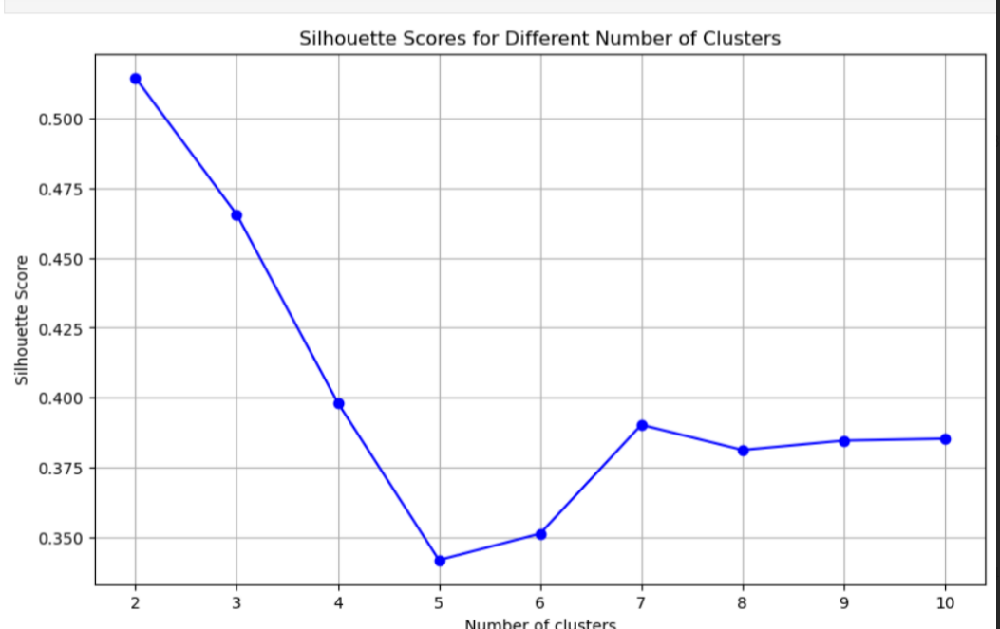
 **Correlation Analysis**  
  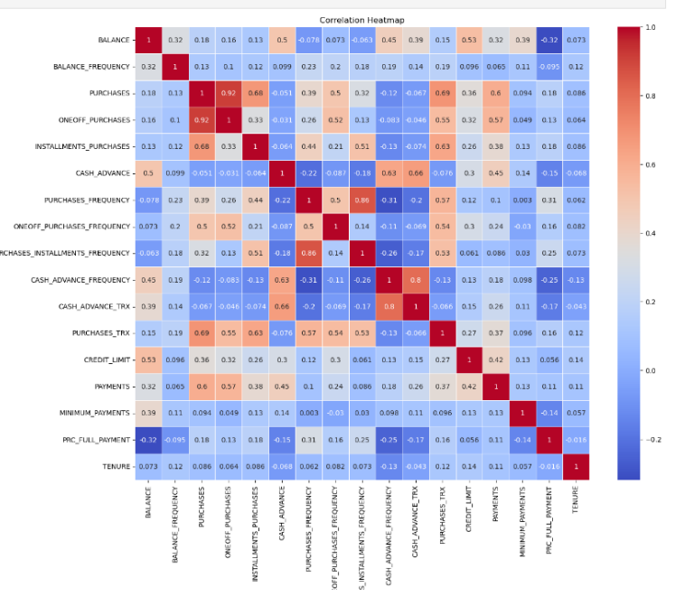
**Dendrogram**  
  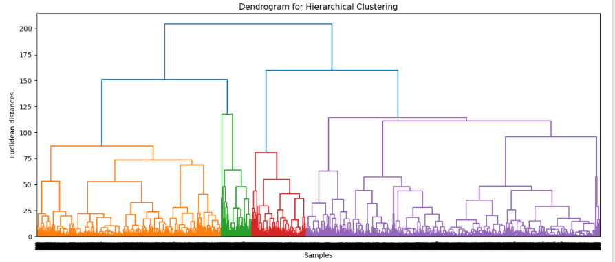
 
   
**Recommendations for Credit Card DataSet:**  
- **K-Means (2 Clusters):** Simple segmentation for broad targeting.  
- **Hierarchical (4 Clusters):** Detailed insights for refined marketing.  
- **CASH_ADVANCE:** Target **high users** with rewards, **low users** with education.  
- **Credit Limit:** Promote for **low usage, high limits** and **raise limits for high usage, low credit limits**.


  **📌 2- Clustering Models On Obesity Dataset:**
  
- 🔗 **Dataset:** **[Estimation of Obesity Levels Based on Eating Habits and Physical Condition](https://archive.ics.uci.edu/dataset/544/estimation+of+obesity+levels+based+on+eating+habits+and+physical+condition)**
  
**📊Key Visualizations from Obesity Dataset:**  
  **Skewness**  
  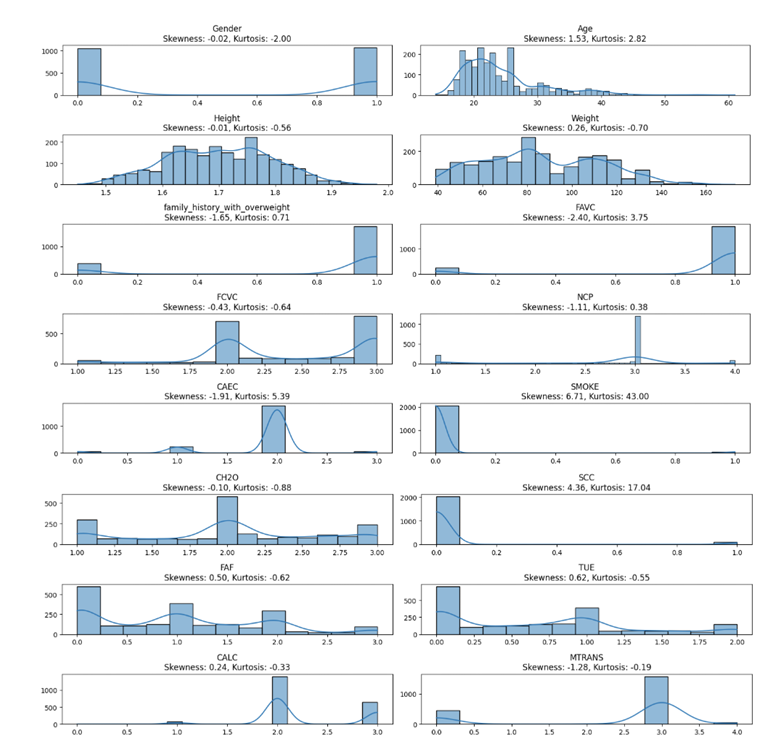
  **HeatMap**  
  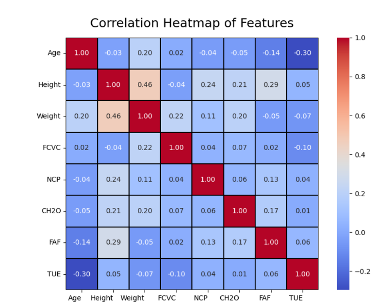
  **Clusters for this Dataset**  
  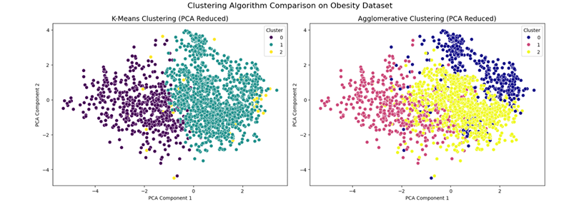

**Recommendations for Obesity  DataSet:**  
- Tailor healthcare products and interventions based on distinct obesity patterns to improve treatment outcomes.

**📌 3 - Clustering Models on Online Shoppers Purchasing Intention Dataset**  

🔗 **Dataset:** [Online Shoppers Purchasing Intention Dataset](https://archive.ics.uci.edu/dataset/468/online+shoppers+purchasing+intention+dataset)  

 **📂 Code Files:**  
 - **Hierarchical Clustering:** [View Notebook](https://github.com/mananabbasi/Machine-Learning-Data-Mining-Extended-Projects/blob/main/Clustering_Hierarchical.ipynb)  
- **K-Means Clustering:** [View Notebook](https://github.com/mananabbasi/Machine-Learning-Data-Mining-Extended-Projects/blob/main/Clustering_Kmeans.ipynb)

**📊 Key Visualizations from Online Shoppers Purchasing Intention Dataset:**
 **Skewness**
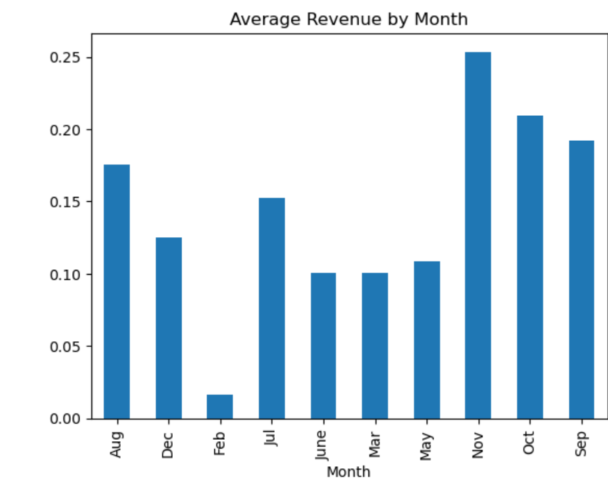
**Revenue Distribution**
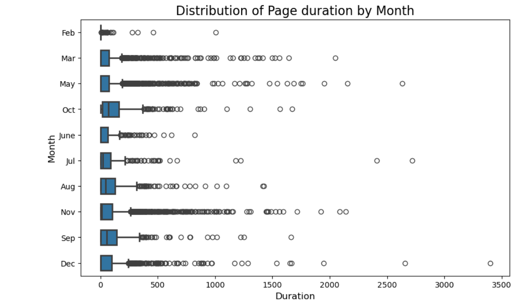
**Customer Clusters**
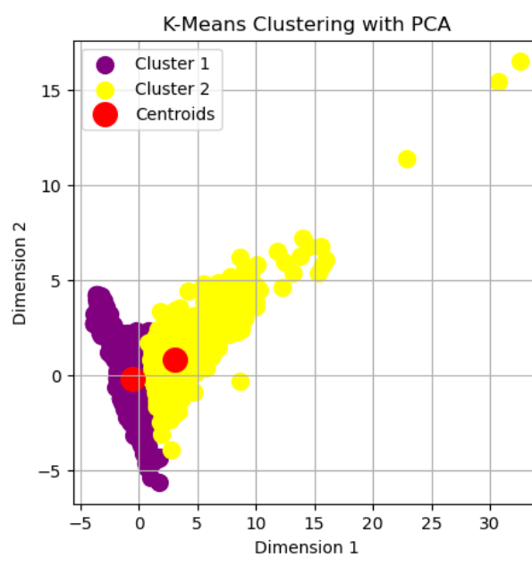

**Recommendations for Online Shoppers Purchasing Intention DataSet:**  
- Use the 2-cluster segmentation to personalize campaigns for returning and new visitors, offering loyalty rewards or introductory promotions.
- Tailor the user experience based on cluster behavior (e.g., Bounce Rates, Product Interaction), offering more engaging content for high-engagement users.
- Focus on high-value clusters by offering exclusive offers or upsell opportunities, while experimenting with strategies to boost low-value clusters.
- Develop loyalty programs for returning visitors to improve retention and engagement.

---

#### 🔹 **C. Sentiment Analysis and Text Classification on Real Time Dataset**  <a name="sentimental-analysics-in-python"></a>
**Duration:** Sep 2024 - Present  

**Objective**  
Developed ML models to analyze sentiment and classify customer reviews from McDonald's US stores , movies and Twitter trends across the world.

**Process:**  
- **Data Preprocessing:** Cleaned data, tokenized, lemmatized, and encoded features with **NLTK** and **Scikit-learn**.  
- **Feature Engineering:** Extracted word frequencies, n-grams, and sentiment scores using **TextBlob** and **TF-IDF**.  
- **Model Development:** Built classification models (Logistic Regression, Random Forest, SVM) and clustering models (K-Means, DBSCAN) for sentiment analysis and review grouping.

**Outcome:**  
- Developed sentiment analysis and classification models, revealing key review patterns and customer sentiment.

**Tools Used:**  
- Python, **Scikit-learn**, **Pandas**, **Matplotlib**, **NLTK**, **TextBlob**

 **📌 1- Sentiment Analysis on the entire U.S. McDonald's reviews dataset**  
 
🔗 **Dataset:** - [US McDonald's Stores Reviews Dataset](https://www.kaggle.com/datasets/nelgiriyewithana/mcdonalds-store-reviews)
**📂 Code Files:**  
- [Sentiment Analysis and Text Classification](https://github.com/mananabbasi/Machine-Learning-and-Data-Mining-/blob/main/Sentimental_Analysis_and_Text_Classification_on_MacDonalds_Dataset.ipynb)

**📊 Key Visualizations from Macdonald Dataset:**  
 **Sentiment Distribution**  
   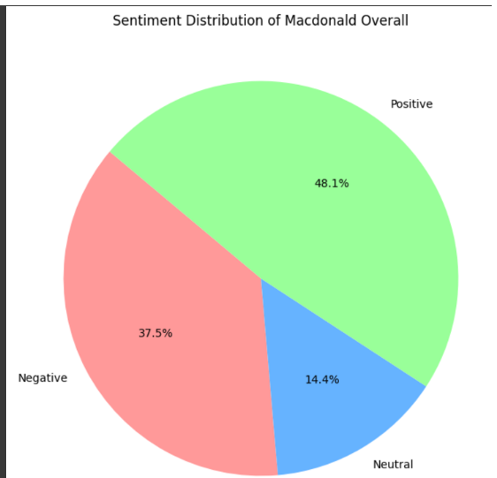
**Positive Reviews**  
   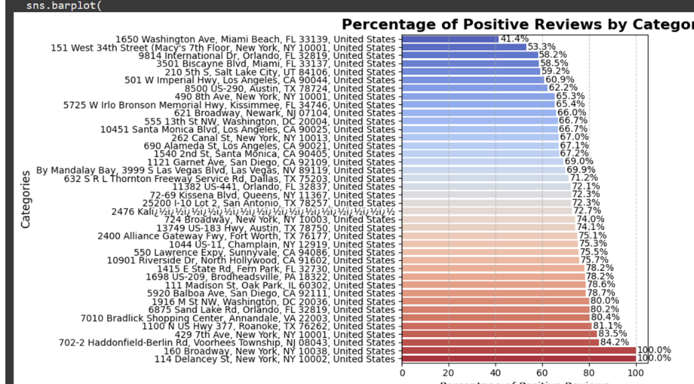
**Negative Reviews & Word Clouds**  
   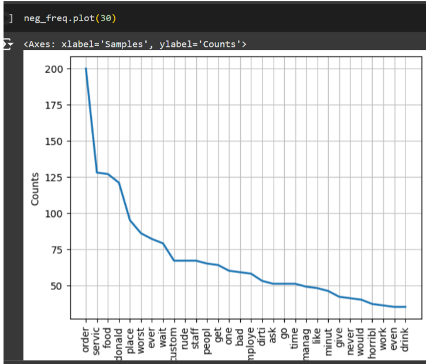
   
**Recommendations from Macdonald Dataset:**  
- **Text Classification:** Use models for real-time customer sentiment analysis and response.  
- **Sentiment Insights:** Focus on improving food quality and service speed at underperforming stores (e.g., Miami Beach).


 **📌 2- Sentiment Analysis on twitter reviews dataset**  

🔗 **Dataset:** [Twitter Sentiment Analysis Dataset](https://www.kaggle.com/datasets/bansalstuti/twitter-sentimental-analysis)

**📊 Key Visualizations from Twitter Dataset**
**Sentiments Across the World**  
   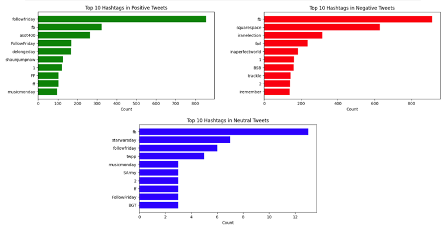

**Tweets Heat Map**  
   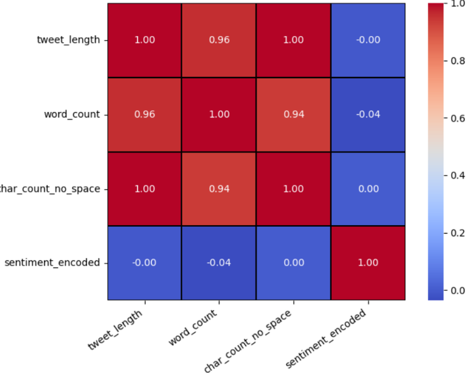

 **Top Words in Positive, Negative, and Neutral Emotions**  
   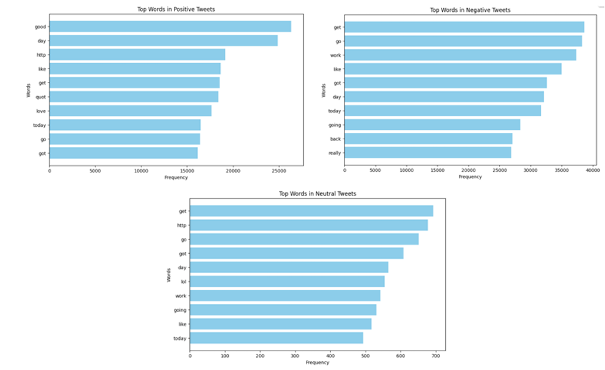
 **Word Cloud Across Sentiments**  
   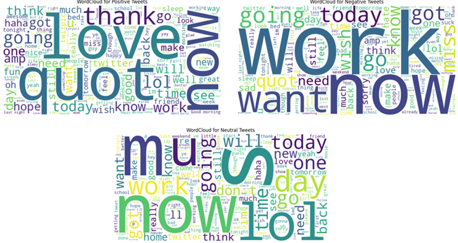
   **Confusion Matrix**
  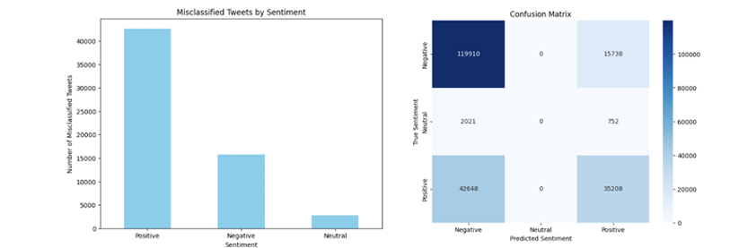

**Recommendations from Twitter Dataset:**  
- Ensure data privacy through anonymization.
- Regularly audit models to minimize bias.
- Use insights responsibly for business decisions.

**📌 3- Sentiment Analysis on Movie Reviews** 

🔗 **Dataset:** [Movies_Reviews_Modified_Version1](https://www.kaggle.com/datasets/nltkdata/movie-review)  
**📂 Code File:** 
- **Sentiment Analysis:** [View Notebook](https://github.com/mananabbasi/Machine-Learning-Data-Mining-Extended-Projects/blob/main/Sentiment_Analysis.ipynb)
**📊 Key Visualizations from Movie Review Dataset**
**Positive Reviews**
  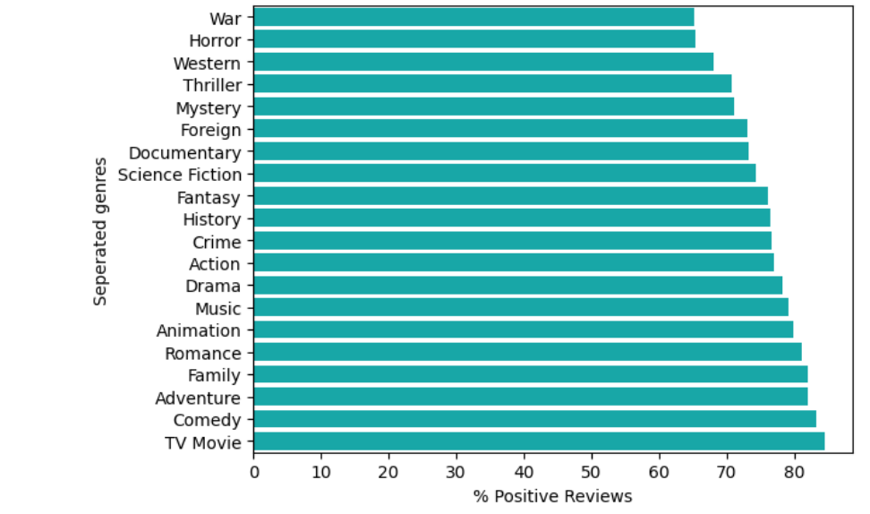
**WordCloud**
  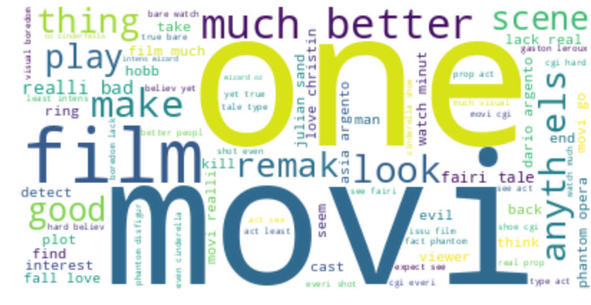


**Recommendations from Movies Reviews Dataset:**  
- Focus on anonymizing data for privacy, improving content through better storytelling, tailoring strategies by genre, and monitoring sentiment for real-time adjustments. Localize campaigns, address negative feedback, and build anticipation with teasers.
---  

### **A. Classification Models on Azure ML Designer**  <a name="classification-models-using-azure-ml-designer"></a> 
**Duration:** Sep 2024 - Present  
🔗 **Dataset:** 
[Banking Dataset](https://archive.ics.uci.edu/dataset/222/bank+marketing)
**📂 Code File:** 
[Azure ML Designer Code](https://github.com/mananabbasi/Azure-ML-Designer)

**Process:**  
1. **Upload & Clean Data:** Import dataset, handle missing values, and split data into training and testing sets.  
2. **Model Selection & Training:** Choose classification algorithms (e.g., Logistic Regression, Decision Tree, SVM), and train the model.  
3. **Model Evaluation:** Evaluate using accuracy, precision, and recall.  
4. **Hyperparameter Tuning & Deployment:** Optionally tune the model and deploy it for real-time predictions.

**Outcome:**  
- Built accurate classification models for client subscription prediction, enabling targeted marketing strategies.

**Tools Used:**  
- **Azure ML Studio**, **Azure ML Designer**, **Logistic Regression**, **Decision Tree**, **Random Forest**, **SVM**, **Hyperparameter Tuning**

**📊 Key Visualizations:**  
- **Model Comparison**:  
   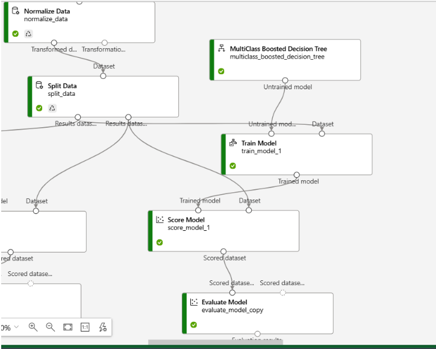  

- **Model Performance**:  
   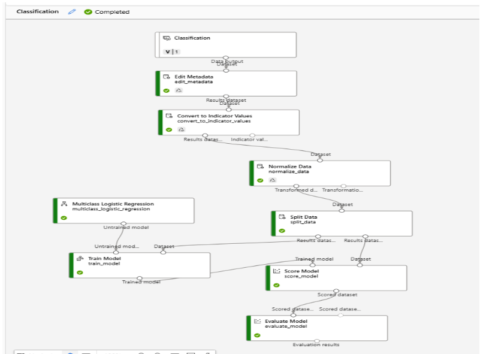  
   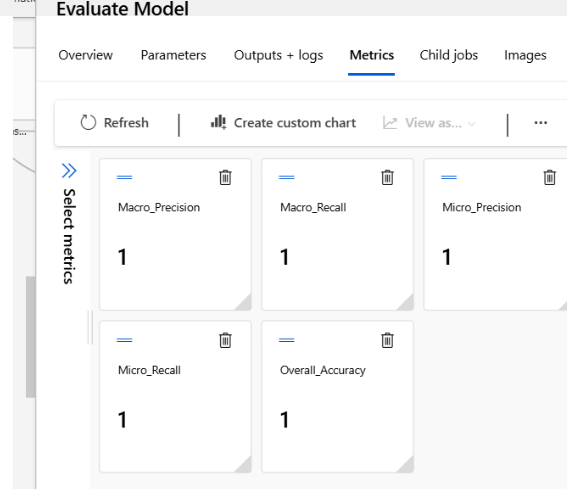

---  

### Databricks Projects with PySpark <a name="databricks-projects-with-pyspark"></a>  

####🔹 **A. Databricks Projects Using PySpark (RDD, DataFrames, and SQL)**  
**Duration:** Jan 2024 - Present  

**Objective:**  
Efficiently process and analyze large-scale datasets using **PySpark** on **Databricks**, creating optimized data pipelines for big data challenges.

🔗 **Dataset:**
- [Clinical Dataset](https://clinicaltrials.gov/data-api/about-api/csv-download)  
- [Pharma Sales Dataset](https://www.kaggle.com/datasets/milanzdravkovic/pharma-sales-data)
# 📂 Code Files
This repository contains the code used for the **Data Science Complete Project** utilizing Big Data tools and techniques. Below are the links to the respective code files:

- **[GitHub Repository](https://github.com/mananabbasi/Data-Science-Complete-Project-using-Big-Data-Tools-Techniques-)**  
  Main repository containing all project resources.

- **[RDD Notebook](https://github.com/mananabbasi/Data-Science-Complete-Project-using-Big-Data-Tools-Techniques-/blob/main/Abdul_Manan_Abbasi_Rdd.ipynb)**  
  Notebook demonstrating operations and analysis with **RDD**.

- **[DataFrame Notebook](https://github.com/mananabbasi/Data-Science-Complete-Project-using-Big-Data-Tools-Techniques-/blob/main/Abdul_Manan_Abbasi_%20Data%20Frame.ipynb)**  
  Notebook for data manipulation and analysis using **DataFrames**.

- **[SQL Script](https://github.com/mananabbasi/Data-Science-Complete-Project-using-Big-Data-Tools-Techniques-/blob/main/Abdul_Manan_Abbasi_SQL.sql)**  
  SQL script used for performing queries and data analysis.

**Process:**  
1. **Data Import & Transformation:**  
   - Used **RDDs** and **DataFrames** to load and clean large datasets.  
   - Applied **Spark SQL** for data aggregation and transformation.  

2. **Optimization:**  
   - Optimized pipelines with **partitioning, caching**, and **parallel processing**.  

3. **Big Data Processing:**  
   - Processed large datasets for real-time insights.

**📊 Key Visualizations:**  
   - Used **Databricks Notebooks** to visualize data and generate reports.
 1. **Working with RDDs**

- **Data Cleaning with RDDs**  
  Visualized the data cleaning process using RDD transformations.  
  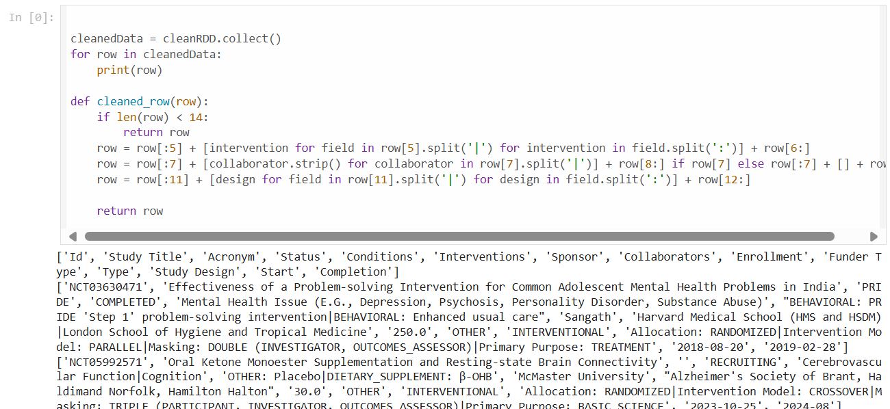

- **Completed Studies Analysis**  
  Overview of completed studies using RDD.  
  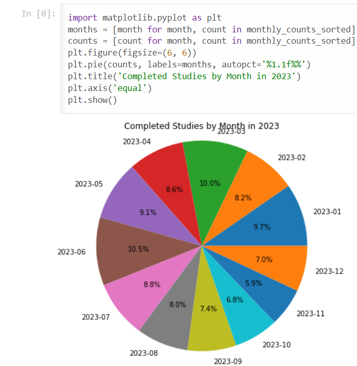

- **Sponsor Type Analysis**  
  Visualization of different sponsor types in the data.  
  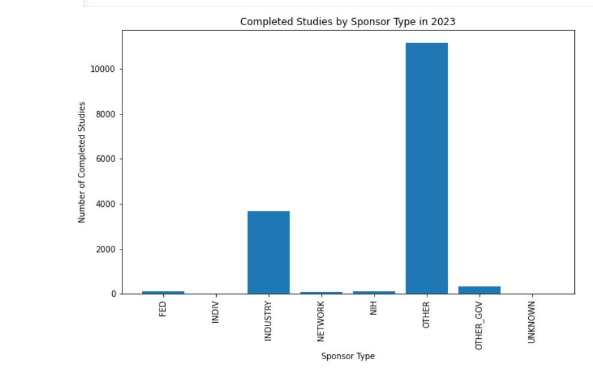

- **Overview of Completed Studies**  
  A summary and insights on completed studies.  
  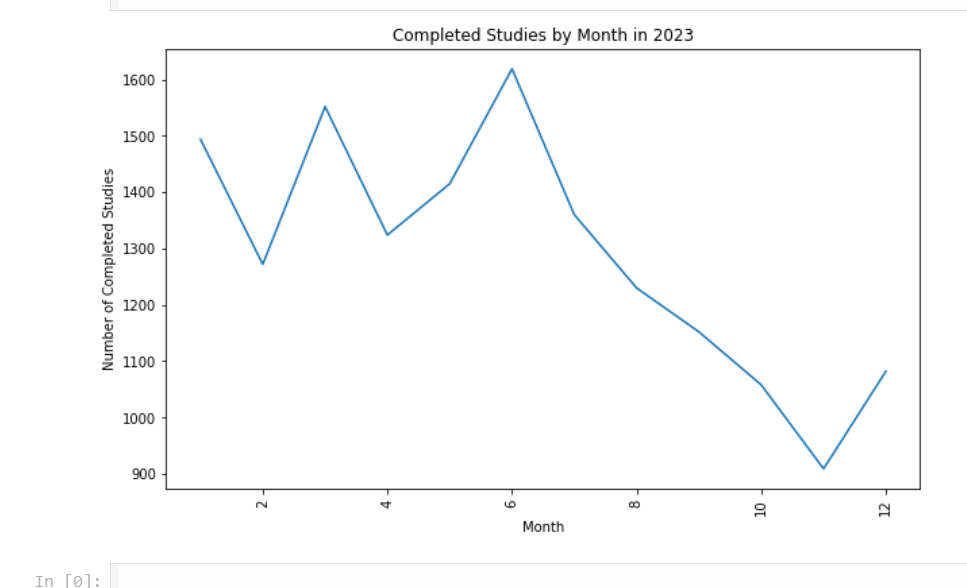

 **2. Working with DataFrames**

- **Data Cleaning with DataFrames**  
  Visualized the process of cleaning and transforming data within DataFrames.  
  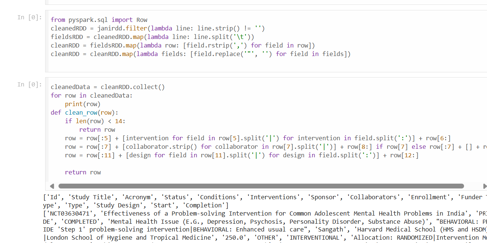

- **Creating DataFrame Schema**   
  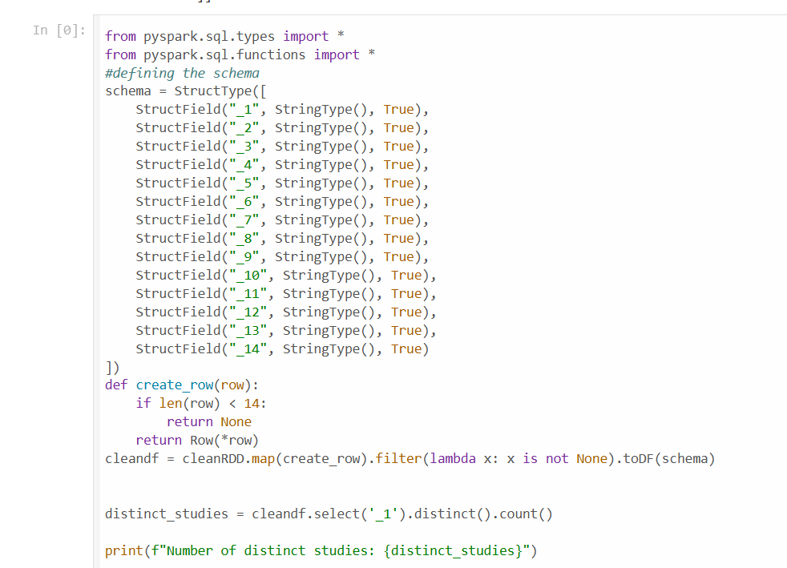

- **Schema Design**  
  Visualization of the DataFrame schema structure.  
  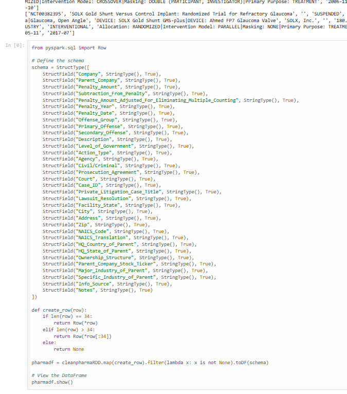

 **3. Working with SQL**
- **SQL-Based Data Analysis**    
  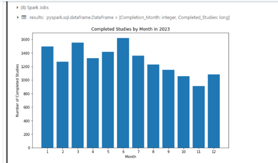

This repository highlights various techniques for cleaning, visualizing, and analyzing data using **RDDs**, **DataFrames**, and **SQL** in **Databricks Notebooks**.

**Outcome:**  
- Developed scalable pipelines for large-scale data processing, enabling real-time analytics.

**Tools Used:**  
- **PySpark** (RDDs, DataFrames, Spark SQL), **Databricks**, **Python**, **Databricks Notebooks**

---

#### 🔹 **B. Steam Data Analysis: Visualization & ALS Evaluation in Databricks**  
**Duration:** Jan 2024 - Present  

**Objective:**  
Analyze large-scale Steam datasets using **PySpark** on **Databricks**, with data visualization and **ALS (Alternating Least Squares)** for recommendation system evaluation.

🔗 **Dataset:** 
- 🎮 [Steam Games Dataset](https://github.com/win7guru/steam-dataset-2024/blob/main/games.zip)  

**📂 Code File:**  
[GitHub: Data Analysis, Visualization & ALS Evaluation](https://github.com/mananabbasi/Data-Analysis-Visualization-ALS-Evaluation-in-Databricks)

**Process:**  
1. **Data Import & Cleaning:** Loaded and cleaned Steam dataset using **PySpark**.  
2. **EDA & Visualization:** Visualized game trends and pricing with **Matplotlib** and **Seaborn**.  
3. **ALS Model:** Built and tuned a recommendation system using **ALS**, optimized with RMSE.  
4. **Predictions & Recommendations:** Generated personalized game suggestions.

**Outcome:**  
- Developed scalable pipelines for real-time analytics and insights.

**Tools Used:**  
- **PySpark** (RDDs, DataFrames, Spark SQL), **Databricks**, **Python**

**📊 Key Visualizations:**  
- **Top 10 Recommendations per User**  
  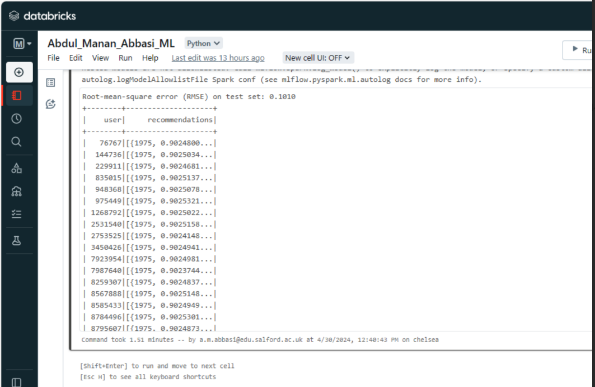

### Power BI Dashboard Development Projects <a name="power-bi-dashboard-development-projects"></a>  
#### 🔹 **A. Power BI Dashboards: Real-Time Insights by Region and Country Group**  
**Duration:** Jan 2024 - Current  

🔗 **Dashboards Repository:**  [GitHub Repository](https://github.com/mananabbasi/Dashboard-Power-bi)

**Objective:**  
Create interactive, real-time dashboards for monitoring business performance and enabling data-driven decision-making.

**Process:**  
- Integrated SQL databases, Excel files, and APIs for real-time data.  
- Designed user-friendly dashboards with slicers, filters, and advanced **DAX** measures.  
- Optimized for fast performance and real-time updates.

**Tools Used:**  
- **Power BI**, **DAX**, **SQL**

#### **📊Key Visualizations**  
 **1.Population  Growth by Real-Time Insights by Region and Country Group***
   **Dataset:** [World Population Prospects 2024](https://population.un.org/wpp/)  
   **Dashboard 1**
  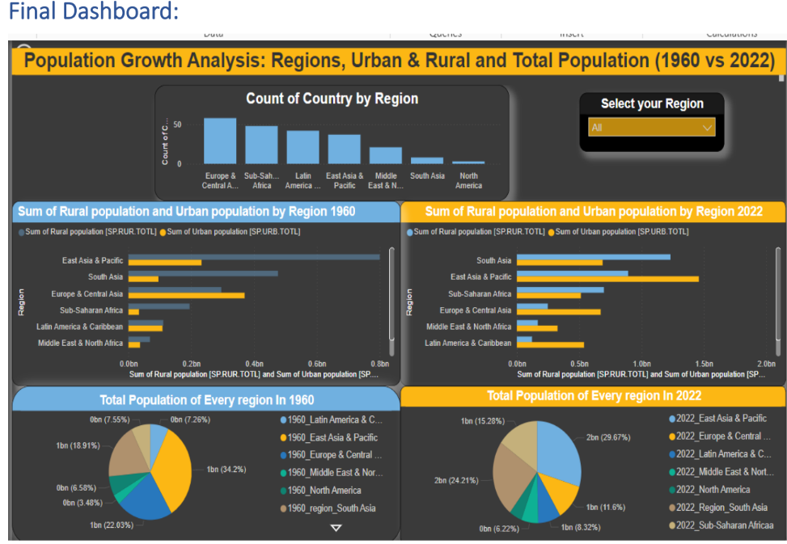
   **Dashboard 2**
  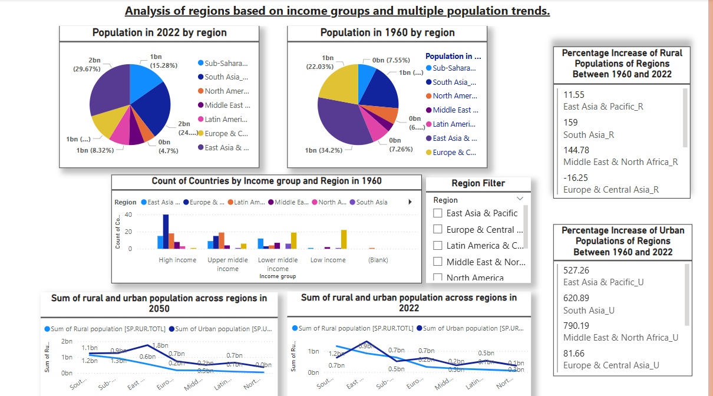
  
**Outcome:**  
-The dashboard provides a comprehensive overview of global population trends, showcasing how population dynamics have evolved between 1960 and 2022.
- Overall Population Growth: Displays the total population growth across all regions during this period.
-  Urban vs. Rural Population Trends: Highlights the shift in population distribution between urban and rural areas, apturing significant urbanization patterns.

**2.HIV Data Dashboard Outcomes by Region and Country Group***
  🔗 **Dataset:**  [World Population Prospects 2024](https://population.un.org/wpp/)  
   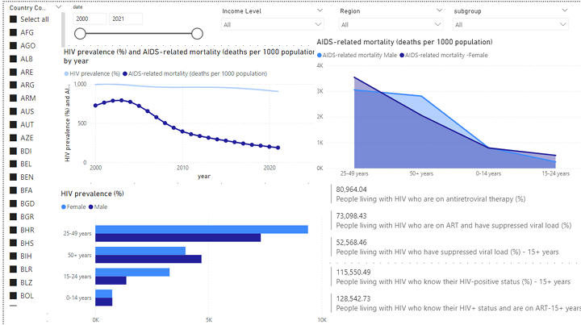
   
**Outcome:**  

- Identifies high-risk regions and populations, guiding targeted healthcare efforts and resource allocation.
- Tracks long-term trends to adjust strategies and meet global HIV targets.
- Highlights ART usage and viral load suppression, raising awareness of treatment gaps.
- Supports advocacy efforts for improved HIV-related policies in high-burden regions.


**3. Sales Report Dashboard***
  🔗 **Dataset:** [World Trend](https://www.makeovermonday.co.uk/)
   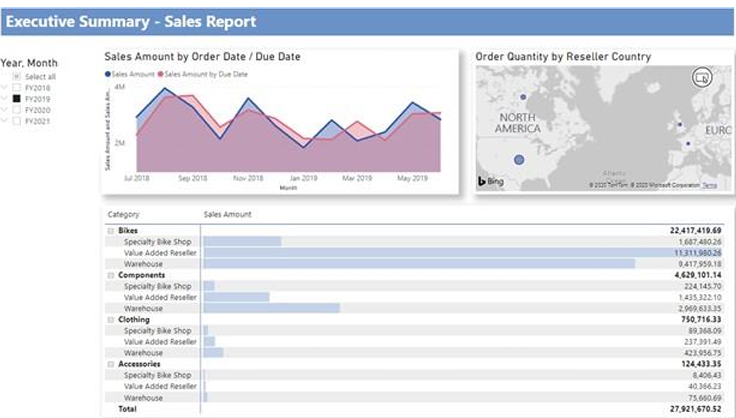
**Outcome:**  
- February 25, 2019, achieved the highest sales, totaling $253,915.47.
- The United States emerged as the top-performing country with 132,748 orders.
- The company should continue investing in the Bikes product category and focus on Value Added Reseller and Warehouse business types for sustained growth..
  
**4. European Energy Transition(2000-2020)***
    🔗 **Dataset:** [Energy Dataset 2000 - 2020](https://acleddata.com/data/)/)  
   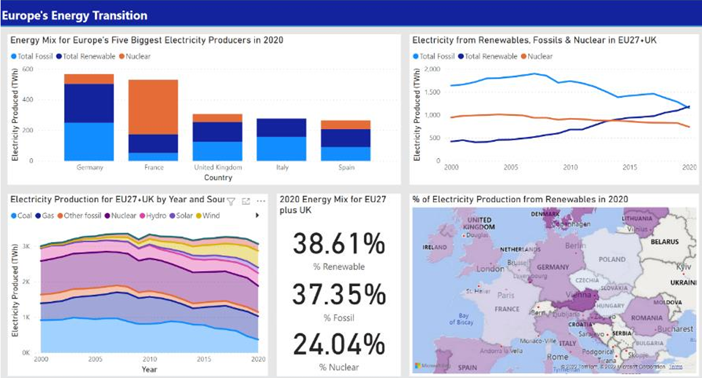
   
**5. European Energy Transition***
   🔗 **Dataset:** [Energu Dataset](https://acleddata.com/data/)/)  
   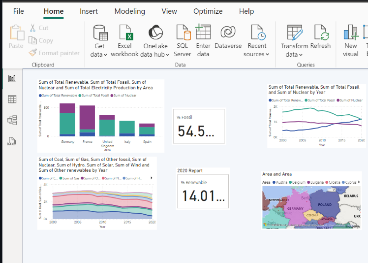
**Outcome:**  
- These dashboard provides insights into European energy production and consumption from 2000 to 2020. It focuses on fossil fuels, renewable energy, and nuclear energy trends across EU countries and the UK.

### Current Projects <a name="current-projects"></a>

Currently, I am working on my dissertation focused on **Cryptocurrency: Global Trends, Acceptance Around the World, and Future Price Predictions** of top currencies based on historical data. The research will involve creating visualizations and reporting to analyze the evolution of cryptocurrencies and their impact on the global market.

**Research Focus:**
- **Global Trends & Acceptance**: Exploring how cryptocurrencies are adopted worldwide and identifying the factors driving adoption and resistance in different regions.
- **Price Predictions**: Using advanced data science techniques like machine learning models, data visualization, and analysis tools (Power BI, Python, R) to predict price trends for leading cryptocurrencies like Bitcoin and Ethereum.
- **Regulatory Challenges & Market Volatility**: Analyzing the regulatory landscape for digital currencies and the impact of market volatility on their adoption.
The research combines **qualitative insights** and **data-driven analysis** to provide valuable perspectives for investors, policymakers, and researchers about the role of cryptocurrencies in the global economy.

**Part-Time Work Experience**
Alongside my dissertation, I am working part-time with **Eagle Cars** and **Tiger Taxi**, helping them generate weekly and monthly reports for better decision-making. This experience allows me to apply my data analysis and reporting skills in real-world scenarios.

## 💼 Work Experience  
<a id="-work-experience"></a>  
I have gained hands-on experience in various data science roles, where I applied my skills to solve real-world business challenges.

### **Data Visualization Analyst (Part-Time)**  
**Eagle Cars & Tiger Taxis | Oct 2024 - Present | Clitheroe, UK**  
- Created weekly and monthly dashboards to report driver performance.  
- Automated reporting processes, reducing manual reporting time by 50%.  
- Developed visualizations that improved decision-making for stakeholders.

### **Data Scientist (Full-Time)**  
**WebDoc | May 2023 - Dec 2023 | Islamabad, Pakistan**  
- Improved data accuracy by 20% through data cleaning and validation.  
- Created over 15 dynamic visualizations to represent complex datasets.  
- Applied regression and classification models to predict user behavior.

### **Data Insights Analyst (Full-Time)**  
**Zones, IT Solutions | Sep 2021 - May 2023 | Islamabad, Pakistan**  
- Developed data-driven strategies that increased customer retention by 18%.  
- Designed and maintained Power BI dashboards for real-time performance tracking.  
- Collaborated with cross-functional teams to design reports for business decisions.

---

## 🎓 Education  
<a id="-education"></a>  
Here’s my academic background that laid the foundation for my career in data science.

### **M.S. in Data Science** _(Expected May 2025)_  
**University of Salford, UK**  
- Coursework: Machine Learning, Big Data Analytics, NLP, Deep Learning

### **B.S. in Software Engineering** _(Graduated May 2022)_  
**Bahria University, Pakistan**  
- Coursework: AI, Data Mining, Web Development, Database Systems

---

## 🎯 Activities  
<a id="-activities"></a>  
In addition to my professional and academic pursuits, I am actively involved in extracurricular activities.

### **President, Dawah Society - Salford University** _(2024)_  
- Organized weekly social events to foster student engagement and unity.

---

## 🔧 How to Use This Repository  
<a id="-how-to-use-this-repository"></a>  
Clone this repository to explore my projects and codebase:  
```bash
git clone https://github.com/mananabbasi

## 📞 Contact
<a id="-contact"></a>
You can get in touch with me through the following channels:

📧 Email: mananw25@gmail.com
🔗 LinkedIn: [ Linkedin Profile](https://www.linkedin.com/in/abdul-manan-4a685926a/)
🐙 GitHub: [ GitHub Profile](https://github.com/mananabbasi)---

