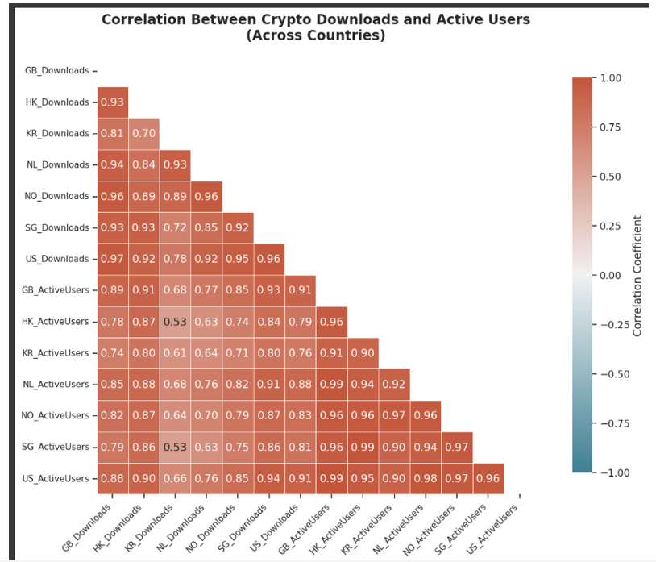
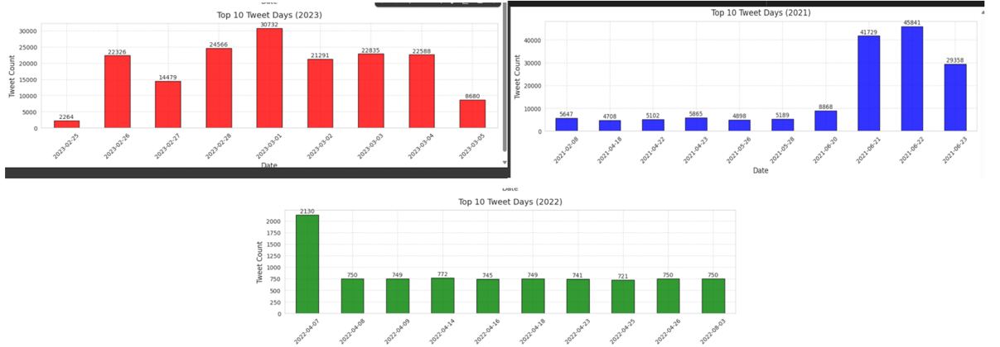
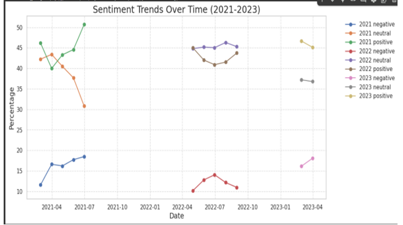
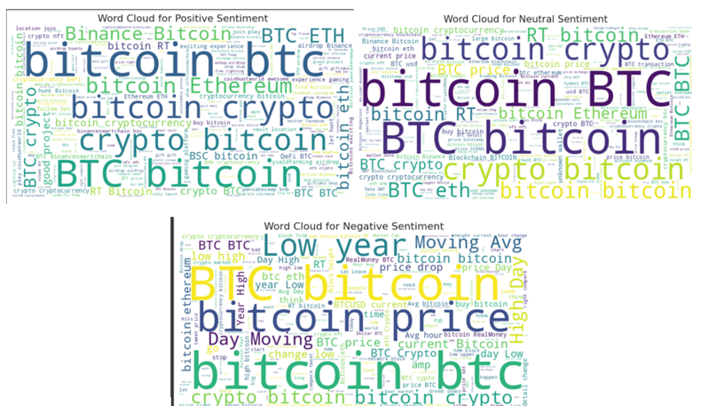
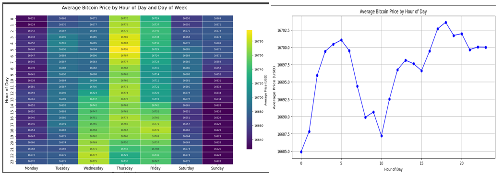
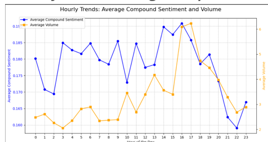
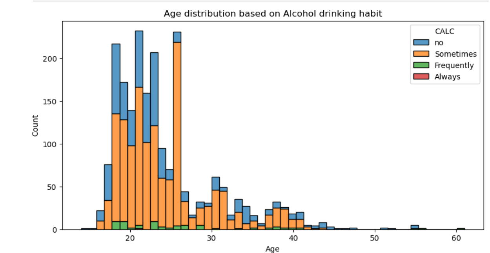

# 🎯 Data Scientist Portfolio  
🌟 Welcome to my Data Scientist Portfolio! 🚀  
A showcase of my work in data analysis, machine learning, and visualization, highlighting my ability to extract insights and build data-driven solutions.

---

## 📌 Table of Contents

- [🌟 About Me](#about-me)  
- [🛠 Skills](#skills)  
- [⚙ Tools & Technologies](#tools--technologies)  
- [🚀 Projects](#projects)  
  - [Dissertation](#dissertation)
    - [1. Introduction](#1-introduction)
    - [2. Dataset](#2-dataset)
    - [3. Cryptocurrency Trends and Global Adoption](#3-cryptocurrency-trends-and-global-adoption)
      - [Conducting Statistical Testing to Check Impact of Events on Bitcoin Price](#conducting-statistical-testing-to-check-impact-of-events-on-bitcoin-price)
    - [4. Social Media Sentiment and Behavioral Insights: Analyzing Bitcoin Tweets (2021–2023)](#4-social-media-sentiment-and-behavioral-insights-analyzing-bitcoin-tweets-20212023)
      - [Minibatch K-Means Clustering Algorithm](#minibatch-k-means-clustering-algorithm)
      - [Sentiment Analysis](#sentiment-analysis)
    - [5. Influencer Users' Tweets on Cryptocurrency (Feb 2021 – Jun 2023) Tweet Dataset](#5-influencer-users-tweets-on-cryptocurrency-feb-2021--jun-2023-tweet-dataset)
      - [Topic Modeling: Analyzing Tweet Themes and Engagement](#topic-modeling-analyzing-tweet-themes-and-engagement)
    - [6. Analyzing Bitcoin Price Data (Minute-by-Minute) and Capturing the Trends from 2012 Till 2025](#6-analyzing-bitcoin-price-data-minute-by-minute-and-capturing-the-trends-from-2012-till-2025)
      - [K-Means Clustering](#k-means-clustering)
    - [7. Combined Analysis of Twitter Sentiment and Bitcoin Market Data](#7-combined-analysis-of-twitter-sentiment-and-bitcoin-market-data)
      - [Doing Statistical Testing](#doing-statistical-testing)
    - [8. Predictive Modeling Using Combined Sentiment and Bitcoin Price Data](#8-predictive-modeling-using-combined-sentiment-and-bitcoin-price-data)
      - [Model Selection and Training](#model-selection-and-training)
      - [Non-Linear Models](#non-linear-models)
        - [Model 1: XGBoost Regressor Model](#model-1-xgboost-regressor-model)
        - [Model 2: Random Forest Regressor Model](#model-2-random-forest-regressor-model)
      - [Comparing Both Models](#comparing-both-models)
      - [Model Recommendations](#model-recommendations)
    - [9. Conclusion](#9-conclusion)
  - [Statistical Analysis Projects with R](#statistical-analysis-projects-with-r)  
  - [Advanced SQL Database Development Projects](#advanced-sql-database-development-projects)  
  - [Data Mining & Machine Learning Projects in Python](#data-mining--machine-learning-projects-in-python)  
    - [A. Real-Time Data Classification Models in Python](#a-real-time-data-classification-models-in-python)  
    - [B. Customer Segmentation Using K-Means and Hierarchical Clustering](#b-customer-segmentation-using-k-means-and-hierarchical-clustering)  
    - [C. Sentiment Analysis and Text Classification on Real-Time Datasets](#c-sentiment-analysis-and-text-classification-on-real-time-datasets)  
  - [Classification Models using Azure ML Designer](#classification-models-using-azure-ml-designer)  
  - [Databricks Projects with PySpark](#databricks-projects-with-pyspark)  
  - [Power BI Dashboard Development Projects](#power-bi-dashboard-development-projects)  
  - [Current Projects](#current-projects)  
- [💼 Work Experience](#work-experience)  
- [🎓 Education](#education)  
- [🎯 Activities](#activities)  
- [📞 Contact](#contact)

---

## Dissertation  
This dissertation explores the growth and volatility of the cryptocurrency market, focusing on Bitcoin, and examines how social media sentiment and app adoption influence market behavior. The study analyzes global trends in cryptocurrency exchange app adoption from 2015 to 2022, considering regional and demographic differences. It also investigates the impact of over 500,000 Bitcoin-related tweets (2021–2023) using NLP, sentiment analysis, and LDA techniques, with a focus on how influential figures shape public sentiment and Bitcoin price movements.

The research aims to better understand the drivers of cryptocurrency market volatility and price fluctuations. By combining historical Bitcoin price data with social media sentiment, the study will develop predictive models to forecast future trends and volatility, offering valuable insights for traders, investors, and policymakers.


#### 1. Introduction
This dissertation focuses on analyzing cryptocurrency adoption, social media sentiment, and market behavior, specifically for Bitcoin. It involves the collection and preprocessing of various datasets, including global cryptocurrency adoption trends, Bitcoin-related tweets from 2021 to 2023, and minute-by-minute Bitcoin price data. The data is cleaned, standardized, and aligned to ensure consistency, and then explored through visualizations such as global adoption maps, time series plots, and sentiment distributions.

The research employs Natural Language Processing (NLP) to analyze tweet sentiment and extract key topics, and it applies feature engineering techniques to Bitcoin data, creating indicators such as moving averages and volatility. To identify patterns in the data, clustering techniques are also used.

For modeling, two regression models—XGBoost and Random Forest—are selected due to their ability to handle complex, non-linear relationships. These models will be trained using data from 2021, 2022, and 2023, and evaluated based on metrics such as RMSE, R-squared, volatility, and MAPE. The goal is to develop predictive models for cryptocurrency trends and volatility, offering insights for traders, investors, and policymakers.

#### 2. Dataset

I have gathered reliable data from multiple platforms, including CoinMarketCap, Mendeley Data, Twitter, and Kaggle, to create four distinct datasets, each serving a specific purpose.

### Datasets Overview

**1. Cryptocurrency Adoption and Exchange Activity (2015–2022)**
This dataset tracks the growth of cryptocurrency users, app downloads, and activity across various cryptocurrency exchanges from 2015 to 2022. Data is sourced from the [Bank for International Settlements](https://view.officeapps.live.com/op/view.aspx?src=https%3A%2F%2Fwww.bis.org%2Fpubl%2Fwork1049_data_xls.xlsx&wdOrigin=BROWSELINK).

**2. Bitcoin Tweets (2021–2023)**
This collection includes Bitcoin-related tweets from 2021, 2022, and 2023, which will be analyzed using Natural Language Processing (NLP) and sentiment analysis to assess public sentiment and its impact on Bitcoin price movements.

- [Bitcoin Tweets (2021)](https://www.kaggle.com/datasets/kaushiksuresh147/bitcoin-tweets/versions/17)
- [Bitcoin Tweets (2022)](https://www.kaggle.com/datasets/alishafaghi/bitcoin-tweets-dataset)
- [Bitcoin Tweets (2023)](https://www.kaggle.com/datasets/kaushiksuresh147/bitcoin-tweets?select=Bitcoin_tweets_dataset_2.csv)

 **3. Influencer Tweets**
This dataset contains tweets from 52 influential figures in the cryptocurrency space. The data is sourced from [Mendeley Data - Influencers Tweets](https://data.mendeley.com/datasets/8fbdhh72gs/5/files/159e4f05-0903-45c1-b12e-e4038805bd97).

**4. Bitcoin Historical Price Data (2012–Present)**
This dataset includes minute-by-minute Bitcoin price data from 2012 to the present, sourced from [Kaggle Bitcoin Historical Data](https://www.kaggle.com/datasets/mczielinski/bitcoin-historical-data).


These datasets will provide a comprehensive basis for analyzing global cryptocurrency adoption trends, social media sentiment, and Bitcoin price behavior. By integrating these sources, the analysis aims to uncover insights into market trends, investor psychology, and the impact of social media on Bitcoin price fluctuations.


#### 3. Cryptocurrency Trends and Global Adoption
Trends from 2015–2022, global app usage, download spikes, and key event impacts.

**3.1 Introduction**
This analysis explores cryptocurrency exchange app adoption across the G20, G7, and 33 countries, using a comprehensive dataset spanning from August 2015 to June 2022. The dataset is organized across ten sheets and captures various dimensions, including user activity, demographics, and the relationship between Bitcoin price trends and app usage. It also offers insights into how external events have influenced cryptocurrency adoption and overall market behavior.

**3.2 Dataset Source**
The dataset can be accessed via the following link:
[Bank for International Settlements Data](https://view.officeapps.live.com/op/view.aspx?src=https%3A%2F%2Fwww.bis.org%2Fpubl%2Fwork1049_data_xls.xlsx&wdOrigin=BROWSELINK)

**3.3 Dataset Overview**
The dataset provides monthly indicators such as downloads, daily active users (DAUs), user demographics, and correlations with Bitcoin price movements. It offers a global perspective on crypto adoption trends and behavioral patterns. The data is distributed across ten distinct sheets:

- I have approximately ten datasets, each of which will be uploaded individually for analysis.
- I will clean and preprocess each dataset separately, followed by reporting the findings and insights derived from each.

**3.4 Key Visualizations**
### Key Visualizations

The analysis includes several key visualizations that help in understanding global cryptocurrency adoption trends, sentiment analysis, and the relationship between Bitcoin price movements and social media activity. Below are the primary types of visualizations included in this project:

#### 1. **Global Cryptocurrency Adoption Trends**
- **Choropleth Maps**: Visualize the global distribution of cryptocurrency adoption by country, highlighting regions with the highest growth in user activity, downloads, and exchange activity from 2015 to 2022.
  
  


#### 2. **Time Series Visualizations**
- **Bitcoin Price and Trading Volume**: Line plots and candlestick charts to track Bitcoin price fluctuations and trading volume over time, highlighting major events and market movements.
  

#### 3. **Sentiment Distribution** 
- **Sentiment Trends Over Time**: A line graph to show the positive, negative, and neutral sentiment trends on Twitter for Bitcoin tweets from 2021 to 2023.
  

- **Word Clouds**: Display the most commonly used terms in Bitcoin-related tweets, with larger words representing higher frequency.

#### 4. **Correlation Between Sentiment and Bitcoin Price**
- **Scatter Plots**: Show the relationship between sentiment scores of Bitcoin-related tweets and Bitcoin price movements.
  

- **Box Plots**: To compare the price volatility during different sentiment phases (positive, neutral, negative).

#### 5. **Behavioral Analysis and Market Trends** 
- **Seasonal Analysis Plots**: Identify seasonal patterns in user behavior and Bitcoin price trends.
  

- **Heatmaps**: To analyze correlations between tweet volume, sentiment, and Bitcoin price during specific time windows.
  

#### 6. **Top 10 Countries for Crypto Adoption**
- **Top Countries**: A bar chart displaying the top 10 countries for cryptocurrency adoption.
  

#### 7. **Other Visualizations**
- **Active Users vs Downloads**: This plot compares the global trend of active users versus downloads.
  
  
- **Impact on Bitcoin Volatility**: How major events in the market affect Bitcoin volatility.
  

- **Loss and Gain Analysis**: Comparing losses and gains in the cryptocurrency market.
  

- **Cryptocurrency Exchange Performance**: Visualization of the performance of different cryptocurrency exchanges.
  

- **Number of Downloads**: A visualization showing the number of downloads across platforms over time.
  

---

These visualizations provide a comprehensive view of the dynamics influencing cryptocurrency markets and adoption, allowing for a deeper understanding of market behavior and sentiment shifts.


##### Conducting Statistical Testing to Check Impact of Events on Bitcoin Price
Using  Wilcoxon signed-rank test and event windows to evaluate how key announcements moved prices.
For the Wilcoxon signed-rank test, which is a non-parametric test (used if the data is not normally distributed):
•	Null Hypothesis (H₀): There is no significant difference in Bitcoin prices before and after the event. 
•	Alternative Hypothesis (H₁): There is a significant difference in Bitcoin prices before and after the event

Since the p-value is less than 0.05, we reject the null hypothesis. This indicates that there is a statistically significant difference between Bitcoin prices before and after the event.
Result from Wilcoxon signed-rank test


•	The before event and after event Bitcoin prices are significantly different, based on the Wilcoxon signed-rank test.
•	Bitcoin price is the biggest driver of engagement, influencing app usage by around 50%, with external events like China's crypto crackdown and Kazakhstan's unrest also playing significant roles.

**Event Impact on Bitcoin**: A chart showing the effect of major events on Bitcoin's price and volatility.
  


#### 4. Social Media Sentiment and Behavioral Insights: Analyzing Bitcoin Tweets (2021–2023)

**4.1 Introduction**
In this section, I shift focus from app usage trends to examining the influence of social media sentiment on cryptocurrency adoption and behavior. Specifically, I analyze Bitcoin-related tweets collected monthly from 2021 to 2023. To uncover patterns in public opinion and community dynamics, I applied Natural Language Processing (NLP) techniques, including sentiment analysis and unsupervised clustering. These methods help categorize sentiment trends over time, identify key discussion topics, and explore how these patterns align with Bitcoin price movements and major news events.

**4.2 Dataset Source:**
All datasets were collected from Kaggle:
- **For 2021**: [Bitcoin Tweets (2021)](https://www.kaggle.com/datasets/kaushiksuresh147/bitcoin-tweets/versions/17)
- **For 2022**: [Bitcoin Tweets (2022)](https://www.kaggle.com/datasets/alishafaghi/bitcoin-tweets-dataset)
- **For 2023**: [Bitcoin Tweets (2023)](https://www.kaggle.com/datasets/kaushiksuresh147/bitcoin-tweets?select=Bitcoin_tweets_dataset_2.csv)

**4.3 Dataset Overview**
The datasets consist of three years' worth of Bitcoin-related tweets, covering 2021, 2022, and 2023. Each dataset contains metadata such as:
- **Timestamp**: The date and time of the tweet.
- **Tweet Text**: The content of the tweet.
- **Engagement Metrics**: Metrics like likes and retweets.
- **User Information** (if available): User details such as location and follower count.


**4.4 Key Visualizations**

### 3.3.4 Key Visualizations: Social Media Sentiment and Tweet Volumes

The following visualizations help analyze Bitcoin-related tweet volume and sentiment over time, revealing patterns in public opinion and engagement with the cryptocurrency:

1. **Combined Daily Tweet Volume**  
   This graph displays the daily tweet volume for Bitcoin across 2021, 2022, and 2023, helping to track spikes in tweet activity.
   

2. **Combined Hourly Tweet Volume**  
   This chart shows the hourly distribution of Bitcoin-related tweets, providing insights into peak times for discussions.
   

3. **Daily Tweet Count (2021–2023)**  
   A daily count of Bitcoin-related tweets for the years 2021, 2022, and 2023, helping to identify key days of high activity.
   

4. **Monthly Tweet Volume (2021–2023)**  
   This plot illustrates the monthly volume of Bitcoin-related tweets, showing seasonal trends and long-term shifts in interest.
   

5. **Top 10 Days for Tweet Volume (2021–2023)**  
   A bar chart highlighting the top 10 days with the highest tweet volumes for Bitcoin, reflecting significant events.
   

6. **Tweet Count per Hour (2021–2023)**  
   This visualization displays the tweet volume per hour for Bitcoin-related tweets across the three years.
   

These visualizations provide a comprehensive overview of the tweet volume dynamics surrounding Bitcoin, allowing for a better understanding of how public sentiment evolves over time.


##### Minibatch K-Means Clustering Algorithm
Detecting tweet clusters (e.g., memes, analysis, FUD, bullish signals).

These visualizations help to understand the underlying clusters of Bitcoin-related tweets and the most prominent topics within each cluster:

1. **Number of Clusters**  
   This visualization shows the number of clusters identified in the Bitcoin tweet dataset, which helps categorize tweets into distinct topics based on sentiment and content.
   

2. **PCA Visualization of Clusters**  
   A Principal Component Analysis (PCA) plot visualizing the tweet clusters in a 2D space, helping to identify relationships and groupings between different tweet topics.
   

3. **Top Words in Clusters**  
   This word cloud highlights the most frequent terms within each cluster, giving insight into the major themes and topics discussed in Bitcoin-related tweets.
   

These visualizations provide valuable insights into how Bitcoin-related discussions are organized and what topics dominate conversations on social media.

##### Sentiment Analysis
Using VADER and TextBlob to derive user sentiment patterns.

1 **Overall Sentiment Distribution**


This chart shows the general distribution of tweet sentiments—positive, negative, and neutral—across the entire dataset. It helps establish a high-level understanding of public opinion.


2 **Sentiment Across Tweets (2021–2023)**


This visualization highlights how sentiment fluctuated across individual tweets throughout the years 2021 to 2023. It’s useful for identifying peaks or drops in sentiment linked to real-world events.


 3 **Sentiment Trend Across Years**



This line graph displays the average sentiment per year, showing how public sentiment evolved over time. Trends can provide insights into broader societal or platform-specific changes.


 4 **Word Cloud of Frequent Terms**



The word cloud highlights the most frequently used words in the tweet dataset. Larger words represent higher frequency, offering a glimpse into common topics and keywords.


#### 5. Influencer Users' Tweets on Cryptocurrency (Feb 2021 – Jun 2023) Tweet Dataset
Tracking popular crypto influencers, tweet timelines, and user engagement.

 **5.1 Introduction**

After analyzing sentiment trends from the 500,000 public tweets collected between 2021 and 2023, the next step involves exploring insights from 52 selected influencer accounts.  
Since this dataset already includes a cleaned text column, additional NLP preprocessing will not be performed.

---

**5.2 Dataset Source**

🔗 [Access the dataset on Mendeley Data](https://data.mendeley.com/datasets/8fbdhh72gs/5/files/159e4f05-0903-45c1-b12e-e4038805bd97)

---

**5.3 Dataset Overview**

This dataset includes tweets from 52 individuals discussing cryptocurrency over a span of more than two years.  
It features:

- Cleaned tweet text
- Engagement metrics (likes, retweets, replies)
- Sentiment analysis scores
- Indicators of tweet importance

This curated dataset provides a rich foundation for examining influencer behavior and public influence trends in the crypto space.

**5.4 Key Visulization**

This section presents visual insights based on tweets from 52 key influencers in the cryptocurrency domain, covering sentiment impact, engagement behavior, tweet characteristics, and overall trends.


1 **Influencer Engagement Metrics**


This chart displays engagement levels (likes, retweets, replies) from influential accounts. It helps identify which influencers generate the most interaction and community response.

2 **Post Volume vs. Sentiment**


This visualization compares the number of tweets posted by influencers with their associated sentiment. It offers insight into whether higher tweet activity correlates with more positive or negative sentiment.

---

 3 **Sentiment Impact on Tweet Engagement**


This chart explores how sentiment (positive, neutral, negative) affects the engagement rate of tweets. Do positive tweets get more likes? Are negative tweets more viral?

---

4 **Tweet Length Distribution**


This figure shows the distribution of tweet lengths among influencers. It helps in understanding whether shorter or longer tweets are more common and how length might relate to engagement or sentiment.

5 **Tweet Posting Trends Over Time**


This time series graph reveals tweet activity patterns from influencers over the analyzed period. It highlights key periods of increased activity or dormancy, potentially linked to major events.


##### Topic Modeling: Analyzing Tweet Themes and Engagement
LDA modeling to explore key topics and trends within influencer tweets.

**Results from Topic Modelling**


 **Topics Engagement and Trends**


This section analyzed tweets from 52 influential crypto figures between February 2021 and June 2023, revealing spikes in engagement during key events, particularly in late 2021, late 2022, and early 2023. While positive sentiment prevailed overall, the most-liked tweet was negative, emphasizing the viral impact of emotionally charged content. 
Topic modeling showed market analysis, Ethereum/DeFi, and Bitcoin updates were most engaging, with BTC discussions having more negative sentiment and a growing interest in whale tracking and transaction-level insights. 


#### 6. Analyzing Bitcoin Price Data (Minute-by-Minute) and Capturing the Trends from 2012 Till 2025
Decomposing Bitcoin volatility and trend cycles using clustering.


**6.1 Introduction**

In this analysis, I employ advanced Exploratory Data Analysis (EDA) and clustering techniques to uncover the key trends in Bitcoin's market data. By analyzing minute-by-minute price data from various Bitcoin exchanges, I aim to identify patterns in Bitcoin's price movements and explore how market sentiment influences these trends.  
Using clustering, I seek to gain a deeper understanding of the factors driving Bitcoin's market behavior, providing valuable insights into its volatility and trading dynamics.

---

**6.2 Dataset Source**

🔗 [Access the dataset on Kaggle](https://www.kaggle.com/datasets/mczielinski/bitcoin-historical-data)

---

**6.3 Dataset Overview**

This dataset contains historical minute-by-minute data for Bitcoin's price across various exchanges. It includes:

- Bitcoin price (high, low, open, close)
- Trading volume
- Market capitalization
- Timestamp of each data entry

The dataset spans a significant period and offers a detailed view of Bitcoin's price volatility and trading trends, making it ideal for EDA and clustering techniques.

**6.4 Key Visualizations**


1 **Bitcoin Average Price Daily**


This chart shows the average Bitcoin price on a daily basis. It provides an overview of the general trend of Bitcoin's price over time.

---

2 **Bitcoin Average Price Over the Year**


This graph shows how Bitcoin's average price changed throughout the year. It helps to identify seasonal trends and year-on-year comparisons.

---

3 **Bitcoin Close Price Over Time**


This visualization tracks Bitcoin's closing price over a defined period, showcasing key fluctuations and trends in its daily close prices.

---

4 **Bitcoin Price and Rolling Statistics**


This plot visualizes Bitcoin's price along with its rolling statistics (like moving averages), providing insights into short-term price trends and volatility.

---

5 **Bitcoin Price for Three Different Years (2021, 2022, 2023)**


This graph compares Bitcoin's price trends across three years: 2021, 2022, and 2023. It highlights key differences in price behavior between these years.

---

6 **Bitcoin Trading Volume Over Time**


This chart shows the trading volume of Bitcoin over time, reflecting the level of market activity and investor interest during various periods.

---

#7 **Correlation Heatmap**


This heatmap illustrates the correlation between different Bitcoin market variables (such as price, volume, market cap). It helps in understanding how these factors interact.

---

8 **Monthly Average Bitcoin Price**


This plot shows the monthly average price of Bitcoin, helping to identify long-term trends and how Bitcoin’s price behaves across different months of the year.

---

 9 **Volume and Close Price**


This chart shows the relationship between Bitcoin's trading volume and its closing price. It highlights how trading volume can affect price movements and indicate market sentiment.


##### K-Means Clustering
Labeling volatility phases, identifying price regimes and anomaly detection.

**PCA Components for Bitcoin**


This plot visualizes the Principal Component Analysis (PCA) components for Bitcoin. It helps in understanding how different features contribute to the overall variance in Bitcoin’s price data.


**Cluster Summary**


This summary plot provides insights into the clustering results. It shows how the different clusters of Bitcoin market data are distributed, giving an overview of the key groupings and their characteristics.


**Number of Clusters for Bitcoin**


Seasonal and weekly patterns reveal price peaks in mid-February, March, and November, with notable dips in summer and on Sundays, while clustering analysis identifies two market behaviors: Cluster 0 with high, stable prices and low volume, and Cluster 1 with lower prices, higher volumes, and more volatility.


#### 7. Combined Analysis of Twitter Sentiment and Bitcoin Market Data
Aligning tweets and price by timestamp to extract correlation patterns.


**7.1 Introduction**

In this section, I integrate the cleaned Twitter dataset from 2021 to 2023, complete with sentiment labels and intensity scores, with Bitcoin market data to explore potential relationships between public sentiment and price dynamics. By aligning both datasets on the date column, I aim to uncover how fluctuations in social media sentiment correspond with Bitcoin’s price movements, trading volume, and volatility.  
This combined analysis forms a crucial bridge between behavioral signals and financial trends, setting the stage for predictive modeling in the following section.


**7.2 Dataset Source**

I will use the dataset described in Chapter 3.2, which was created by merging tweets from various months in 2021, 2022, and 2023 into a single collection. Before combining, the tweets were carefully filtered to remove spam and irrelevant content.


**7.3 Dataset Overview**

The integrated dataset contains:

- **Tweets**: Collected from various Twitter accounts (including influencers) from 2021 to 2023.
  - Sentiment labels (positive, neutral, negative)
  - Sentiment intensity scores (scaled from 0 to 1)
  - Engagement metrics (likes, retweets, replies)
  
- **Bitcoin Market Data**: Includes minute-by-minute price data, trading volume, and market cap across various exchanges.
  - Price data (open, close, high, low)
  - Trading volume
  - Timestamp of each data entry
  
By combining these two datasets, this analysis provides an opportunity to explore how social media sentiment may correlate with Bitcoin's market movements.


**7.4 Key visualization**


1 **2021 Sentiment and Price Distribution**


This chart visualizes the sentiment distribution and corresponding Bitcoin price data for 2021. It helps to see how public sentiment affected Bitcoin's price during this period.

---

2 **2022 Sentiment and Price Distribution**


This visualization tracks sentiment and Bitcoin price distribution in 2022, providing insights into the relationship between market sentiment and price fluctuations over this year.

---

3 **2023 Sentiment and Price Distribution**


Here, sentiment distribution for 2023 is compared with Bitcoin's price trends. The analysis highlights how sentiment may have impacted Bitcoin's price in this year.

---

4 **Average Compound Score and Sentiment**


This graph displays the average sentiment compound scores and their corresponding intensity over time, providing insights into overall sentiment shifts across the three years.

---

5 **Correlation Across All Three Time Periods**


This heatmap visualizes the correlation between sentiment and Bitcoin's market data (price, volume, volatility) for the years 2021, 2022, and 2023. It helps to identify any changes or consistent relationships over time.

---

6 **Sentiment vs. Average Closing Price**


This chart explores the relationship between sentiment and Bitcoin's average closing price. It aims to uncover any correlation between positive/negative sentiment and Bitcoin's daily closing price.

---

7 **Sentiment vs. Trading Volume**


This visualization compares sentiment scores with Bitcoin's trading volume, helping to assess whether increased sentiment intensity leads to more trading activity.

---

8 **Sentiment vs. Trading Volume (Alternate View)**


This alternate view of sentiment vs. trading volume provides additional insights into how public sentiment correlates with Bitcoin's trading volume over time.


##### Doing Statistical Testing

**T-test**

Null Hypothesis (H₀): There is no significant difference in the average Bitcoin closing price between positive sentiment and negative sentiment.
Alternative Hypothesis (H₁): There is a significant difference in the average Bitcoin closing price between positive sentiment and negative sentiment.


### 📉 **T-Test Results**


Reject the null hypothesis If the p-value is below 0.05, it suggests that the average Bitcoin price is significantly different between positive and negative sentiment.

### 📈 **Plotting the Results**


The boxplot shows that Bitcoin closing prices are slightly higher on positive sentiment days compared to negative ones. 
While both sentiment types show similar price ranges and outliers, the median price is higher with positive sentiment, suggesting a mild link between optimistic tweets and stronger Bitcoin performance.

#### 8. Predictive Modeling Using Combined Sentiment and Bitcoin Price Data

**8.1 Introduction**

After combining the Bitcoin Twitter sentiment dataset with the Bitcoin price dataset, I obtained a unified dataset that captures both market behavior and public sentiment over time. This dataset will serve as the foundation for building predictive models aimed at forecasting Bitcoin price movements.  

To determine the most suitable modeling approach, I will begin by conducting normality tests on the features and target variable. This step will help assess whether data distribution supports the use of linear models or calls for more flexible, non-linear alternatives. If the data appears stable and well-behaved, I will consider using XGBoost due to its accuracy and ability to handle structured data efficiently. On the other hand, if the data shows signs of volatility or noise, Random Forest will be the preferred choice, as it tends to perform well with complex, fluctuating patterns. This model selection process will ensure that the final approach aligns with the nature of the data and yields the most reliable predictive results.

---

**8.2 Dataset Source**

Following the integration of the Bitcoin Twitter sentiment dataset with the Bitcoin price dataset in Chapter 3.5, I obtained a unified dataset that reflects both market dynamics and public sentiment over time. This combined dataset will form the basis for developing predictive models to forecast Bitcoin price movements.

---

**8.3 Dataset Overview for Modelling**

The unified dataset includes the following features:

- **Public Sentiment Data**:
  - Sentiment labels (positive, neutral, negative)
  - Sentiment intensity scores (scaled from 0 to 1)
  - Engagement metrics (likes, retweets, replies)
  
- **Bitcoin Market Data**:
  - Price data (open, close, high, low)
  - Trading volume
  - Market capitalization
  
This combined dataset will be used to develop models aimed at predicting Bitcoin's price movements, considering the impact of social media sentiment on the market.


##### Model Selection and Training
Modeling pipeline using cross-validation and grid search.
**QQ Plot for Normality Test**


This QQ plot helps assess whether the data follows a normal distribution, which is important for determining the suitability of linear models for predictive modeling.


 **Shapiro-Wilk Test for Normality**


The Shapiro-Wilk test results provide another measure of normality. If the p-value is above a threshold, the null hypothesis of normality cannot be rejected, indicating that the data is approximately normally distributed.


##### Non-Linear Models

**Result: No Linearity**


This visualization indicates that there is no clear linear relationship between the features and the target variable. This suggests that linear models may not be the most suitable approach for this dataset. Non-linear models such as XGBoost or Random Forest may be more appropriate for capturing the complex patterns in the data.

Since the data does not meet the assumption of normality, I will use non-linear models for analysis. I will use two Nonlinear models and compare their results

###### Model 1: XGBoost Regressor Model
Powerful gradient boosting approach for price prediction.


**Feature Importance in XGBoost**


This plot illustrates the feature importance in the XGBoost model. It highlights the most significant features contributing to the prediction of Bitcoin price movements, allowing for insights into which factors, such as sentiment or trading volume, have the largest influence on price changes.

---

**Time Series Forecasting for 2021 using XGBoost**


This visualization shows the time series forecasting results for 2021 using the XGBoost model. It compares the predicted Bitcoin prices with the actual prices, providing insights into the model's forecasting accuracy for the year.

---

**Time Series Forecasting for 2022 using XGBoost**


This plot presents the time series forecasting results for 2022 using the XGBoost model. It shows the predicted Bitcoin prices for the year and compares them with the actual market prices to evaluate the model's performance.

---

**Time Series Forecasting for 2023 using XGBoost**


This visualization displays the time series forecasting results for 2023. It highlights the predicted Bitcoin prices and compares them with the actual prices to assess the model's forecasting ability for this year.

###### Model 2: Random Forest Regressor Model
Bagging ensemble for capturing sentiment-driven volatility.


### 📊 **Feature Importance in Random Forest**


This plot illustrates the feature importance in the Random Forest model. It highlights the most significant features contributing to the prediction of Bitcoin price movements, showing which factors have the largest impact on price changes.

**Time Series Forecasting for 2021 using Random Forest Regression**


This visualization shows the time series forecasting results for 2021 using the Random Forest model. It compares the predicted Bitcoin prices with the actual prices, providing insights into the model's forecasting accuracy for the year.


**Time Series Forecasting for 2022 using Random Forest Regression**


This plot presents the time series forecasting results for 2022 using the Random Forest model. It shows the predicted Bitcoin prices for the year and compares them with the actual market prices to evaluate the model's performance.


**Time Series Forecasting for 2023 using Random Forest Regression**


This visualization displays the time series forecasting results for 2023. It highlights the predicted Bitcoin prices and compares them with the actual prices to assess the model's forecasting ability for this year.


##### Comparing Both Models
Metric evaluation: RMSE, MAE, and R² comparisons.etc

**Random Forest Regression Model Performance**


This table shows the performance of the Random Forest Regression model. It highlights key performance metrics such as accuracy, precision, recall, and RMSE, which are used to assess the model's effectiveness in predicting Bitcoin prices.

---

**XGBoost Model Performance**


This table displays the performance of the XGBoost model. It includes key metrics to evaluate how well the model forecasts Bitcoin prices, comparing its results against actual price data for accuracy and reliability.


##### Model Recommendations

XGBoost performed best in stable periods (Periods 1 & 2), delivering higher accuracy and better fit. Random Forest excelled in Period 3, where volatility was highest, showing greater resilience to market fluctuations. 
Overall, XGBoost is ideal for stable market conditions, while Random Forest is better for volatile environments.


#### 9. Conclusion


**9.1 Insights & Findings**

**9.1.1 Cryptocurrency Adoption & Market Behavior**
- **Developed Nations**: Countries like Turkey, the US, the UK, and South Korea are leading the way in cryptocurrency adoption.
- **Emerging Markets**: In contrast, emerging markets such as China, India, and Indonesia face challenges including regulatory barriers and inadequate infrastructure.
- **Retail Investor Losses**: 82% of retail investors have experienced losses, primarily from entering the market during its peak price phases (Bitcoin prices ranging between $45K–$60K).
- **Bitcoin Price Volatility**: Bitcoin price volatility is a significant factor influencing user engagement, with external shocks (e.g., China’s crypto ban) causing disruptions.

**9.1.2 Social Media Sentiment & Public Perception**
- **Sentiment Trends**: Neutral sentiment was most dominant, though there were notable spikes in both positive and negative sentiment during major market events.
- **Viral Tweets**: Viral tweets often reflected negative sentiment, showcasing fear-driven narratives and market uncertainty.
- **Engagement Peaks**: User engagement was highest mid-week (Wednesdays) and during late afternoons (15:00–16:00), indicating optimal times for market-sensitive announcements.
- **Growing Interest**: There was an increasing interest in technical analysis topics, including Decentralized Finance (DeFi), whale tracking, and broader market trends.

**9.1.3 Bitcoin Price Trends & Volatility**
- **Seasonal Patterns**: Bitcoin prices exhibited seasonal fluctuations, with surges typically seen in Q1 and Q4, and downturns during the summer months.
- **Three Distinct Market Phases**:
  - **2021**: High volatility driven largely by sentiment.
  - **2022**: A steady downtrend marked by more muted sentiment.
  - **2023**: Sideways price movement with negative sentiment despite low trading volume.
- **Price and Volume Correlation**: A weak negative correlation between trading volume and price was observed, suggesting that other macroeconomic factors play a larger role in driving price movements.

**9.1.4 Predictive Modeling Insights**
- **XGBoost**: Performed best during stable market conditions (2021–2022), providing higher accuracy in forecasting.
- **Random Forest**: Showed more resilience during periods of high volatility (2023), adapting better to erratic market movements.
- **Sentiment Analysis**: While sentiment analysis improved forecasting accuracy, it had limited predictive power when used alone. This highlights the importance of combining multiple data sources (such as price and sentiment data) for more robust predictive models.

---

**9.2 Future Recommendations**

**9.2.1 For Investors & Traders**
- **Hybrid Modeling Strategies**:
  - **XGBoost** is recommended for stable market periods (e.g., predicting bull/bear trends).
  - **Random Forest** is suggested for volatile market periods (e.g., during geopolitical crises).
- **Sentiment Monitoring**: Investors should keep an eye on sentiment spikes, particularly negative tweets, as these may indicate impending market movements.

---

**9.3 Key Recommendations**

Based on the findings, the following strategic recommendations are made for cryptocurrency platforms, investors, and stakeholders:

- **Focus on Developed Markets**: Focus efforts on developed markets such as Turkey, the US, the UK, and South Korea, which show strong adoption rates and active user bases.
- **Improve Adoption in Emerging Markets**: Address barriers to adoption in emerging markets by tackling regulatory uncertainties and infrastructure gaps.
- **User Education**: Educate users on risk management to prevent emotional decision-making, particularly during market peaks and crashes.
- **Monitor External Events**: Keep a close watch on external factors like geopolitical events and regulatory changes, which can have significant impacts on market dynamics.


---

## 🌟 About Me <a name="-about-me"></a>  
I am a data scientist dedicated to solving complex problems using data-driven methods. Specializing in statistics, machine learning, data visualization, and big data processing, I transform raw data into valuable insights. Always eager to learn, I continuously expand my knowledge and adapt to new technologies in the field.

---

## 🛠 Skills <a name="-skills"></a>  

### Technical Skills:  
- **Programming Languages**: Python, R, SQL  
- **Machine Learning**: Classification, Regression, Clustering, Deep Learning  
- **Big Data & Cloud**: Spark, Hadoop, AWS, GCP  
- **Data Visualization**: Power BI, Tableau, Matplotlib, Seaborn  
- **Statistical Analysis**: Hypothesis Testing, ANOVA, Regression Analysis  

### Soft Skills:  
- **Problem Solving**  
- **Communication**  
- **Collaboration**  
- **Adaptability**  
- **Critical Thinking**

---

## ⚙ Tools & Technologies <a name="-tools--technologies"></a>  
I am proficient in a range of tools and technologies that help me effectively analyze data and develop insights.

- **Programming Languages**: Python, R, SQL  
- **Libraries/Frameworks**: Pandas, NumPy, Scikit-learn, TensorFlow, PyTorch  
- **Databases**: MySQL, PostgreSQL, MongoDB  
- **Big Data & Cloud**: AWS, Azure, GCP, Hadoop, Spark  
- **Data Visualization**: Power BI, Tableau, Matplotlib, Seaborn  
- **Development Tools**: Jupyter Notebook, VS Code, Git

---

## 🚀 Projects <a name="-projects"></a>  


### Dissertation <a name="-dissertation"></a>  
A full-scale academic project that explores Bitcoin market behavior, user sentiment, and forecasting trends using a multi-stage data pipeline.

#### 1. Introduction
Background, motivation, objectives, and overall roadmap of the dissertation.

#### 2. Dataset
Details of all datasets used — Twitter, App Adoption, and Bitcoin minute-wise data (2012–2025).

#### 3. Cryptocurrency Trends and Global Adoption
Trends from 2015–2022, global app usage, download spikes, and key event impacts.

##### Conducting Statistical Testing to Check Impact of Events on Bitcoin Price
Using t-tests and event windows to evaluate how key announcements moved prices.

#### 4. Social Media Sentiment and Behavioral Insights: Analyzing Bitcoin Tweets (2021–2023)
Preprocessing, feature extraction, and behavioral clustering of tweets.

##### Minibatch K-Means Clustering Algorithm
Detecting tweet clusters (e.g., memes, analysis, FUD, bullish signals).

##### Sentiment Analysis
Using VADER and TextBlob to derive user sentiment patterns.

#### 5. Influencer Users' Tweets on Cryptocurrency (Feb 2021 – Jun 2023) Tweet Dataset
Tracking popular crypto influencers, tweet timelines, and user engagement.

##### Topic Modeling: Analyzing Tweet Themes and Engagement
LDA modeling to explore key topics and trends within influencer tweets.

#### 6. Analyzing Bitcoin Price Data (Minute-by-Minute) and Capturing the Trends from 2012 Till 2025
Decomposing Bitcoin volatility and trend cycles using clustering.

##### K-Means Clustering
Labeling volatility phases, identifying price regimes and anomaly detection.

#### 7. Combined Analysis of Twitter Sentiment and Bitcoin Market Data
Aligning tweets and price by timestamp to extract correlation patterns.

##### Doing Statistical Testing
Hypothesis tests to validate sentiment-price relationships.

#### 8. Predictive Modeling Using Combined Sentiment and Bitcoin Price Data
Creating models to forecast Bitcoin price using sentiment and historical data.

##### Model Selection and Training
Modeling pipeline using cross-validation and grid search.

##### Non-Linear Models
###### Model 1: XGBoost Regressor Model
Powerful gradient boosting approach for price prediction.

###### Model 2: Random Forest Regressor Model
Bagging ensemble for capturing sentiment-driven volatility.

##### Comparing Both Models
Metric evaluation: RMSE, MAE, and R² comparisons.

##### Model Recommendations
Final suggestions for investors and developers based on results.

#### 9. Conclusion
Key insights, takeaways, and recommendations for future research.


### Statistical Analysis Projects with R <a name="statistical-analysis-projects-with-r"></a>  

#### 🔹 **A. Statistical Analysis & Advanced Statistics using R**  
**Duration:** Sep 2024 - Dec 2025  

🔗 **Dataset:** 
 [Concrete Compressive Strength](https://www.kaggle.com/datasets/ruchikakumbhar/concrete-strength-prediction).
**📂 Github Repository:**  [GitHub Repository](https://github.com/mananabbasi/Applied_Statistics_-_Data_Visualisation_)
**📂 Code File:**  [Code](https://github.com/mananabbasi/Applied_Statistics_-_Data_Visualisation_/blob/main/Statistical%20Analylics%20%20For%20Concrete%20Compressive%20Strength%20Data%20set.R)

**Objective:**  
To perform statistical analysis on the dataset, uncover insights, and support data-driven decision-making by understanding relationships between variables.

**Process:**  
1. **Data Cleaning:** Handled missing values and outliers, ensuring data consistency.  
2. **Exploratory Data Analysis (EDA):** Analyzed distributions and relationships using visualizations.  
3. **Hypothesis Testing:** Conducted t-tests and chi-square tests to validate assumptions.  
4. **Regression Analysis:** Built linear regression models and evaluated performance.  
5. **ANOVA:** Compared means across groups to identify significant differences.  
6. **Visualization:** Created visualizations using **ggplot2** for clear insights.  

**Tools Used:**  
- **R** (ggplot2, dplyr, tidyr, caret, stats, etc.)

#### **📊 Key Visualizations**   
**Numerical Variable Distribution**  
     
**Categorical Variable Distribution**  
     
**Normality Check**  
     
**Correlation Analysis**  
     
**Simple Linear Regression (SLR) Assumptions**  
     
**Regression Model Results**  
     
**Generalized Additive Model (GAM)**  
     

**Outcome:**  
- Delivered actionable insights and statistical reports to stakeholders.  
- Created visualizations and dashboards for effective communication.

---

#### 🔹 **B. Time Series Forecasting Models in R**  
**Duration:** Nov 2024 - Dec 2024  
🔗 **Dataset:**  [Vital Statistics in the UK](https://www.ons.gov.uk/peoplepopulationandcommunity/populationandmigration/populationestimates/datasets/vitalstatisticspopulationandhealthreferencetables).

**📂 Code File:**  [Vital Statistics in the UK - Time Series Modelling](https://github.com/mananabbasi/Time-Series-Modelling/blob/main/Birth_time_series.R)

**Objective:**  
To develop accurate time series forecasting models for predicting future trends, enabling stakeholders to optimize business strategies.

**Process:**  
1. **Data Preparation:** Collected and cleaned historical time series data.  
2. **Model Selection:** Evaluated **ARIMA**, **SARIMA**, and **ETS** models for accuracy.  
3. **Model Evaluation:** Used **RMSE** and **MAE** to measure model performance.  
4. **Visualization:** Created visualizations to compare predicted vs actual values.

**Tools Used:**  
- **R** (forecast, tseries, ggplot2)

#### **📊 Key Visualizations**   
**Additive Model with Increasing or Decresing Trends**
  
**Forecasting Results**  
     
**Forecast Errors**  
     

**Outcome:**  
- Provided actionable insights through thorough EDA and robust regression model evaluation.  
- Significantly improved inventory management efficiency and informed data-driven decision-making.

---
### Advanced SQL Database Development Projects <a name="advanced-sql-database-development-projects"></a>  

#### 🔹 **A. Hospital Database Development (Microsoft SQL Server)**  
**Duration:** Jan 2024 - Apr 2024  
**📂 Code Files:** 
- [Hospital Database](https://github.com/mananabbasi/Data-Science-Project-using-the-3NF-to-create-tables-and-insert-data-using-contrain-using-Advance-SQL/blob/main/%4000752004_task1.sql.sql)
- [Restuarent Database](https://github.com/mananabbasi/Data-Science-Project-using-the-3NF-to-create-tables-and-insert-data-using-contrain-using-Advance-SQL/blob/main/%4000752004_task2.sql.sql)
  
**Objective:**  
Designed and implemented a scalable, high-performance hospital database to manage large volumes of data.

**Process:**  
- Created ER diagrams and normalized the schema.  
- Optimized the database with indexing for fast queries.  
- Automated tasks using stored procedures and triggers to improve efficiency.

**Tools Used:**  
- **Microsoft SQL Server**, **T-SQL**
**Key Visualizations**  

**Database Diagram for Restuarent**  
  
**Database Diagram for Hospiatl**  

 **Total Appointments** 
The total number of appointments is shown in the following visualization:


**Outcome:**  
- Developed a fully operational, scalable database system.  
- Optimized for fast queries, improved data integrity, and easy management of hospital data.

---
### Data Mining & Machine Learning Projects in Python <a name="data-mining--machine-learning-projects-in-python"></a>  
---
---

#### 🔹 **A. Real-Time Data Classification Models in Python** <a name="classification-models-in-python"></a>  

**Duration:** Sep 2024 - Present  

**Objective:**  
Developed ML models to predict client subscription to term deposits using real world dataset.

**Process:**  
- Preprocessed data and built **classification** Models (Logistic Regression, Random Forest, SVM, K-Means, DBSCAN).  
- Evaluated models with accuracy, precision, recall, F1, and silhouette scores.  
- Performed hyperparameter tuning using **GridSearchCV** and **RandomizedSearchCV**.

**Outcome:**  
- Delivered accurate predictive models, uncovering customer behavior patterns.

**Tools Used:** Python, Scikit-learn, Pandas, Matplotlib

**📌 1- Classification Models On Banking Datasets:**  

- 🔗 **Dataset:** **[Bank Marketing Dataset](https://archive.ics.uci.edu/dataset/222/bank+marketing)**  
  
**📂 Code Files:**  
- [KNN Classification](https://github.com/mananabbasi/Machine-Learning-and-Data-Mining-/blob/main/KNN%20-%20Classification%20with%20Class%20Imbalance.ipynb)  
- [Decision Tree Classification](https://github.com/mananabbasi/Machine-Learning-and-Data-Mining-/blob/main/Classification%20Decision_Tree%20with%20class%20imbalance.ipynb)

**📊 Key Visualizations from Banking Dataset:**  

**Data Exploration**  
   

**Model Performance**  
     
   
   
**Actionable Recommendations For Banking DataSet:**  
- Use **Decision Tree** over KNN for better performance.  
- Focus on **call duration for Banking dataset** (Feature 12).  
- Target **college-educated, married individuals (30-40)** in **management roles**.  
- Optimal campaign timing: **mid-month** and **summer months**.  
- Prioritize **mobile contact** and impactful first interactions.
  
**📌 2- Classification Models On Agriculture Datasets:**  
- 🔗 **Dataset:** **[Cinar & Koklu (2019) Rice Variety Dataset](https://archive.ics.uci.edu/dataset/545/rice+cammeo+and+osmancik)**
  
**📊 Key Visualizations from Agriculture Dataset:**  
**Data Exploration for Agriculture Dataset**  
   

**Model Performance on Agriculture Dataset**  
   

**Actionable Recommendations For Agriculture DataSet:**  
  
-  Implement machine learning models to classify rice varieties, improving accuracy in quality control and sorting.  
-  Use KNN classification insights to optimize rice variety categorization, enhancing inventory management and logistics.
-  Leverage data for better breeding strategies and customized farming techniques, boosting crop yield and quality.


**📌 3- Classification Models on Obesity Dataset**

🔗 **Dataset:** **[Estimation of Obesity Levels Based on Eating Habits and Physical Condition]**(https://archive.ics.uci.edu/dataset/544/estimation+of+obesity+levels+based+on+eating+habits+and+physical+condition)  

**📂 Code Files:**
- [Decision Tree Classifier:](https://github.com/mananabbasi/Machine-Learning-Data-Mining-Extended-Projects/blob/main/Classification_Decision_Tree.ipynb)  
- [K-Nearest Neighbors (KNN) Classifier:](https://github.com/mananabbasi/Machine-Learning-Data-Mining-Extended-Projects/blob/main/Classification_KNN.ipynb)

**📊 Key Visualizations from Obesity Dataset:**  
**Gender Distribution**
  

**Age Distribution**
  

**Confusion Matrix**  
   
---

**Actionable Recommendations For Agriculture DataSet:**  
- AI-driven nutrition & fitness programs for better health recommendations.  
- Identify at-risk individuals and collaborate with insurers for prevention.  
- Launch smart health devices, AI assessments, and tailored meal plans.  
- Track obesity trends and optimize strategies with dashboards. 


#### 🔹 **B. Customer Segmentation Using K-Means and Hierarchical Clustering** <a name="clustering-in-python"></a>

**Duration:** Sep 2024 - Present  

**Objective:**  
Developed ML models for customer segmentation using clustering techniques to identify distinct groups and optimize marketing strategies.

**Process:**  
- **Data Preparation:** Cleaned and encoded data using **Pandas**.  
- **Clustering:** Applied **K-Means** and **Hierarchical Clustering**, scaled features, and used **PCA** for dimensionality reduction.  
- **Evaluation & Optimization:** Used **Silhouette Score** and **Elbow Method** to evaluate clusters.  
- **Visualization:** Created visualizations for actionable insights.

**Outcome:**  
- Developed scalable pipelines for real-time insights and enhanced decision-making.

**Tools Used:**  
- Python, Scikit-learn, Pandas, Matplotlib

 **📌 1- Clustering Models On Credit Card Marketing Dataset:**  

🔗 **Dataset:** **[Credit Card Marketing Dataset](https://www.kaggle.com/datasets/arjunbhasin2013/ccdata?resource=download)**

**📂 Code Files:**  
- [K-Means Clustering](https://github.com/mananabbasi/Machine-Learning-and-Data-Mining-/blob/main/ClusteringK-Means.ipynb)  
- [Hierarchical Clustering](https://github.com/mananabbasi/Machine-Learning-and-Data-Mining-/blob/main/Dendogram_Clustring.ipynb)


**📊Key Visualizations from Credit Card Marketing Dataset:**  
 
 **Number of Clusters**  
  
 **Correlation Analysis**  
  
**Dendrogram**  
  
 
   
**Recommendations for Credit Card DataSet:**  
- **K-Means (2 Clusters):** Simple segmentation for broad targeting.  
- **Hierarchical (4 Clusters):** Detailed insights for refined marketing.  
- **CASH_ADVANCE:** Target **high users** with rewards, **low users** with education.  
- **Credit Limit:** Promote for **low usage, high limits** and **raise limits for high usage, low credit limits**.


  **📌 2- Clustering Models On Obesity Dataset:**
  
- 🔗 **Dataset:** **[Estimation of Obesity Levels Based on Eating Habits and Physical Condition](https://archive.ics.uci.edu/dataset/544/estimation+of+obesity+levels+based+on+eating+habits+and+physical+condition)**
  
**📊Key Visualizations from Obesity Dataset:**  
  **Skewness**  
  
  **HeatMap**  
  
  **Clusters for this Dataset**  
  

**Recommendations for Obesity  DataSet:**  
- Tailor healthcare products and interventions based on distinct obesity patterns to improve treatment outcomes.

**📌 3 - Clustering Models on Online Shoppers Purchasing Intention Dataset**  

🔗 **Dataset:** [Online Shoppers Purchasing Intention Dataset](https://archive.ics.uci.edu/dataset/468/online+shoppers+purchasing+intention+dataset)  

 **📂 Code Files:**  
 - **Hierarchical Clustering:** [View Notebook](https://github.com/mananabbasi/Machine-Learning-Data-Mining-Extended-Projects/blob/main/Clustering_Hierarchical.ipynb)  
- **K-Means Clustering:** [View Notebook](https://github.com/mananabbasi/Machine-Learning-Data-Mining-Extended-Projects/blob/main/Clustering_Kmeans.ipynb)

**📊 Key Visualizations from Online Shoppers Purchasing Intention Dataset:**
 **Skewness**

**Revenue Distribution**

**Customer Clusters**


**Recommendations for Online Shoppers Purchasing Intention DataSet:**  
- Use the 2-cluster segmentation to personalize campaigns for returning and new visitors, offering loyalty rewards or introductory promotions.
- Tailor the user experience based on cluster behavior (e.g., Bounce Rates, Product Interaction), offering more engaging content for high-engagement users.
- Focus on high-value clusters by offering exclusive offers or upsell opportunities, while experimenting with strategies to boost low-value clusters.
- Develop loyalty programs for returning visitors to improve retention and engagement.

---

#### 🔹 **C. Sentiment Analysis and Text Classification on Real Time Dataset**  <a name="sentimental-analysics-in-python"></a>
**Duration:** Sep 2024 - Present  

**Objective**  
Developed ML models to analyze sentiment and classify customer reviews from McDonald's US stores , movies and Twitter trends across the world.

**Process:**  
- **Data Preprocessing:** Cleaned data, tokenized, lemmatized, and encoded features with **NLTK** and **Scikit-learn**.  
- **Feature Engineering:** Extracted word frequencies, n-grams, and sentiment scores using **TextBlob** and **TF-IDF**.  
- **Model Development:** Built classification models (Logistic Regression, Random Forest, SVM) and clustering models (K-Means, DBSCAN) for sentiment analysis and review grouping.

**Outcome:**  
- Developed sentiment analysis and classification models, revealing key review patterns and customer sentiment.

**Tools Used:**  
- Python, **Scikit-learn**, **Pandas**, **Matplotlib**, **NLTK**, **TextBlob**

 **📌 1- Sentiment Analysis on the entire U.S. McDonald's reviews dataset**  
 
🔗 **Dataset:** - [US McDonald's Stores Reviews Dataset](https://www.kaggle.com/datasets/nelgiriyewithana/mcdonalds-store-reviews)
**📂 Code Files:**  
- [Sentiment Analysis and Text Classification](https://github.com/mananabbasi/Machine-Learning-and-Data-Mining-/blob/main/Sentimental_Analysis_and_Text_Classification_on_MacDonalds_Dataset.ipynb)

**📊 Key Visualizations from Macdonald Dataset:**  
 **Sentiment Distribution**  
   
**Positive Reviews**  
   
**Negative Reviews & Word Clouds**  
   
   
**Recommendations from Macdonald Dataset:**  
- **Text Classification:** Use models for real-time customer sentiment analysis and response.  
- **Sentiment Insights:** Focus on improving food quality and service speed at underperforming stores (e.g., Miami Beach).


 **📌 2- Sentiment Analysis on twitter reviews dataset**  

🔗 **Dataset:** [Twitter Sentiment Analysis Dataset](https://www.kaggle.com/datasets/bansalstuti/twitter-sentimental-analysis)

**📊 Key Visualizations from Twitter Dataset**
**Sentiments Across the World**  
   

**Tweets Heat Map**  
   

 **Top Words in Positive, Negative, and Neutral Emotions**  
   
 **Word Cloud Across Sentiments**  
   
   **Confusion Matrix**
  

**Recommendations from Twitter Dataset:**  
- Ensure data privacy through anonymization.
- Regularly audit models to minimize bias.
- Use insights responsibly for business decisions.

**📌 3- Sentiment Analysis on Movie Reviews** 

🔗 **Dataset:** [Movies_Reviews_Modified_Version1](https://www.kaggle.com/datasets/nltkdata/movie-review)  
**📂 Code File:** 
- **Sentiment Analysis:** [View Notebook](https://github.com/mananabbasi/Machine-Learning-Data-Mining-Extended-Projects/blob/main/Sentiment_Analysis.ipynb)
**📊 Key Visualizations from Movie Review Dataset**
**Positive Reviews**
  
**WordCloud**
  


**Recommendations from Movies Reviews Dataset:**  
- Focus on anonymizing data for privacy, improving content through better storytelling, tailoring strategies by genre, and monitoring sentiment for real-time adjustments. Localize campaigns, address negative feedback, and build anticipation with teasers.
---  

### **A. Classification Models on Azure ML Designer**  <a name="classification-models-using-azure-ml-designer"></a> 
**Duration:** Sep 2024 - Present  
🔗 **Dataset:** 
[Banking Dataset](https://archive.ics.uci.edu/dataset/222/bank+marketing)
**📂 Code File:** 
[Azure ML Designer Code](https://github.com/mananabbasi/Azure-ML-Designer)

**Process:**  
1. **Upload & Clean Data:** Import dataset, handle missing values, and split data into training and testing sets.  
2. **Model Selection & Training:** Choose classification algorithms (e.g., Logistic Regression, Decision Tree, SVM), and train the model.  
3. **Model Evaluation:** Evaluate using accuracy, precision, and recall.  
4. **Hyperparameter Tuning & Deployment:** Optionally tune the model and deploy it for real-time predictions.

**Outcome:**  
- Built accurate classification models for client subscription prediction, enabling targeted marketing strategies.

**Tools Used:**  
- **Azure ML Studio**, **Azure ML Designer**, **Logistic Regression**, **Decision Tree**, **Random Forest**, **SVM**, **Hyperparameter Tuning**

**📊 Key Visualizations:**  
- **Model Comparison**:  
     

- **Model Performance**:  
     
   

---  

### Databricks Projects with PySpark <a name="databricks-projects-with-pyspark"></a>  

####🔹 **A. Databricks Projects Using PySpark (RDD, DataFrames, and SQL)**  
**Duration:** Jan 2024 - Present  

**Objective:**  
Efficiently process and analyze large-scale datasets using **PySpark** on **Databricks**, creating optimized data pipelines for big data challenges.

🔗 **Dataset:**
- [Clinical Dataset](https://clinicaltrials.gov/data-api/about-api/csv-download)  
- [Pharma Sales Dataset](https://www.kaggle.com/datasets/milanzdravkovic/pharma-sales-data)
# 📂 Code Files
This repository contains the code used for the **Data Science Complete Project** utilizing Big Data tools and techniques. Below are the links to the respective code files:

- **[GitHub Repository](https://github.com/mananabbasi/Data-Science-Complete-Project-using-Big-Data-Tools-Techniques-)**  
  Main repository containing all project resources.

- **[RDD Notebook](https://github.com/mananabbasi/Data-Science-Complete-Project-using-Big-Data-Tools-Techniques-/blob/main/Abdul_Manan_Abbasi_Rdd.ipynb)**  
  Notebook demonstrating operations and analysis with **RDD**.

- **[DataFrame Notebook](https://github.com/mananabbasi/Data-Science-Complete-Project-using-Big-Data-Tools-Techniques-/blob/main/Abdul_Manan_Abbasi_%20Data%20Frame.ipynb)**  
  Notebook for data manipulation and analysis using **DataFrames**.

- **[SQL Script](https://github.com/mananabbasi/Data-Science-Complete-Project-using-Big-Data-Tools-Techniques-/blob/main/Abdul_Manan_Abbasi_SQL.sql)**  
  SQL script used for performing queries and data analysis.

**Process:**  
1. **Data Import & Transformation:**  
   - Used **RDDs** and **DataFrames** to load and clean large datasets.  
   - Applied **Spark SQL** for data aggregation and transformation.  

2. **Optimization:**  
   - Optimized pipelines with **partitioning, caching**, and **parallel processing**.  

3. **Big Data Processing:**  
   - Processed large datasets for real-time insights.

**📊 Key Visualizations:**  
   - Used **Databricks Notebooks** to visualize data and generate reports.
 1. **Working with RDDs**

- **Data Cleaning with RDDs**  
  Visualized the data cleaning process using RDD transformations.  
  

- **Completed Studies Analysis**  
  Overview of completed studies using RDD.  
  

- **Sponsor Type Analysis**  
  Visualization of different sponsor types in the data.  
  

- **Overview of Completed Studies**  
  A summary and insights on completed studies.  
  

 **2. Working with DataFrames**

- **Data Cleaning with DataFrames**  
  Visualized the process of cleaning and transforming data within DataFrames.  
  

- **Creating DataFrame Schema**   
  

- **Schema Design**  
  Visualization of the DataFrame schema structure.  
  

 **3. Working with SQL**
- **SQL-Based Data Analysis**    
  

This repository highlights various techniques for cleaning, visualizing, and analyzing data using **RDDs**, **DataFrames**, and **SQL** in **Databricks Notebooks**.

**Outcome:**  
- Developed scalable pipelines for large-scale data processing, enabling real-time analytics.

**Tools Used:**  
- **PySpark** (RDDs, DataFrames, Spark SQL), **Databricks**, **Python**, **Databricks Notebooks**

---

#### 🔹 **B. Steam Data Analysis: Visualization & ALS Evaluation in Databricks**  
**Duration:** Jan 2024 - Present  

**Objective:**  
Analyze large-scale Steam datasets using **PySpark** on **Databricks**, with data visualization and **ALS (Alternating Least Squares)** for recommendation system evaluation.

🔗 **Dataset:** 
- 🎮 [Steam Games Dataset](https://github.com/win7guru/steam-dataset-2024/blob/main/games.zip)  

**📂 Code File:**  
[GitHub: Data Analysis, Visualization & ALS Evaluation](https://github.com/mananabbasi/Data-Analysis-Visualization-ALS-Evaluation-in-Databricks)

**Process:**  
1. **Data Import & Cleaning:** Loaded and cleaned Steam dataset using **PySpark**.  
2. **EDA & Visualization:** Visualized game trends and pricing with **Matplotlib** and **Seaborn**.  
3. **ALS Model:** Built and tuned a recommendation system using **ALS**, optimized with RMSE.  
4. **Predictions & Recommendations:** Generated personalized game suggestions.

**Outcome:**  
- Developed scalable pipelines for real-time analytics and insights.

**Tools Used:**  
- **PySpark** (RDDs, DataFrames, Spark SQL), **Databricks**, **Python**

**📊 Key Visualizations:**  
- **Top 10 Recommendations per User**  
  

### Power BI Dashboard Development Projects <a name="power-bi-dashboard-development-projects"></a>  
#### 🔹 **A. Power BI Dashboards: Real-Time Insights by Region and Country Group**  
**Duration:** Jan 2024 - Current  

🔗 **Dashboards Repository:**  [GitHub Repository](https://github.com/mananabbasi/Dashboard-Power-bi)

**Objective:**  
Create interactive, real-time dashboards for monitoring business performance and enabling data-driven decision-making.

**Process:**  
- Integrated SQL databases, Excel files, and APIs for real-time data.  
- Designed user-friendly dashboards with slicers, filters, and advanced **DAX** measures.  
- Optimized for fast performance and real-time updates.

**Tools Used:**  
- **Power BI**, **DAX**, **SQL**

#### **📊Key Visualizations**  
 **1.Population  Growth by Real-Time Insights by Region and Country Group***
   **Dataset:** [World Population Prospects 2024](https://population.un.org/wpp/)  
   **Dashboard 1**
  
   **Dashboard 2**
  
  
**Outcome:**  
-The dashboard provides a comprehensive overview of global population trends, showcasing how population dynamics have evolved between 1960 and 2022.
- Overall Population Growth: Displays the total population growth across all regions during this period.
-  Urban vs. Rural Population Trends: Highlights the shift in population distribution between urban and rural areas, apturing significant urbanization patterns.

**2.HIV Data Dashboard Outcomes by Region and Country Group***
  🔗 **Dataset:**  [World Population Prospects 2024](https://population.un.org/wpp/)  
   
   
**Outcome:**  

- Identifies high-risk regions and populations, guiding targeted healthcare efforts and resource allocation.
- Tracks long-term trends to adjust strategies and meet global HIV targets.
- Highlights ART usage and viral load suppression, raising awareness of treatment gaps.
- Supports advocacy efforts for improved HIV-related policies in high-burden regions.


**3. Sales Report Dashboard***
  🔗 **Dataset:** [World Trend](https://www.makeovermonday.co.uk/)
   
**Outcome:**  
- February 25, 2019, achieved the highest sales, totaling $253,915.47.
- The United States emerged as the top-performing country with 132,748 orders.
- The company should continue investing in the Bikes product category and focus on Value Added Reseller and Warehouse business types for sustained growth..
  
**4. European Energy Transition(2000-2020)***
    🔗 **Dataset:** [Energy Dataset 2000 - 2020](https://acleddata.com/data/)/)  
   
   
**5. European Energy Transition***
   🔗 **Dataset:** [Energu Dataset](https://acleddata.com/data/)/)  
   
**Outcome:**  
- These dashboard provides insights into European energy production and consumption from 2000 to 2020. It focuses on fossil fuels, renewable energy, and nuclear energy trends across EU countries and the UK.

### Current Projects <a name="current-projects"></a>

Currently, I am working on my dissertation focused on **Cryptocurrency: Global Trends, Acceptance Around the World, and Future Price Predictions** of top currencies based on historical data. The research will involve creating visualizations and reporting to analyze the evolution of cryptocurrencies and their impact on the global market.

**Research Focus:**
- **Global Trends & Acceptance**: Exploring how cryptocurrencies are adopted worldwide and identifying the factors driving adoption and resistance in different regions.
- **Price Predictions**: Using advanced data science techniques like machine learning models, data visualization, and analysis tools (Power BI, Python, R) to predict price trends for leading cryptocurrencies like Bitcoin and Ethereum.
- **Regulatory Challenges & Market Volatility**: Analyzing the regulatory landscape for digital currencies and the impact of market volatility on their adoption.
The research combines **qualitative insights** and **data-driven analysis** to provide valuable perspectives for investors, policymakers, and researchers about the role of cryptocurrencies in the global economy.

**Part-Time Work Experience**
Alongside my dissertation, I am working part-time with **Eagle Cars** and **Tiger Taxi**, helping them generate weekly and monthly reports for better decision-making. This experience allows me to apply my data analysis and reporting skills in real-world scenarios.

## 💼 Work Experience  
<a id="-work-experience"></a>  
I have gained hands-on experience in various data science roles, where I applied my skills to solve real-world business challenges.

### **Data Visualization Analyst (Part-Time)**  
**Eagle Cars & Tiger Taxis | Oct 2024 - Present | Clitheroe, UK**  
- Created weekly and monthly dashboards to report driver performance.  
- Automated reporting processes, reducing manual reporting time by 50%.  
- Developed visualizations that improved decision-making for stakeholders.

### **Data Scientist (Full-Time)**  
**WebDoc | May 2023 - Dec 2023 | Islamabad, Pakistan**  
- Improved data accuracy by 20% through data cleaning and validation.  
- Created over 15 dynamic visualizations to represent complex datasets.  
- Applied regression and classification models to predict user behavior.

### **Data Insights Analyst (Full-Time)**  
**Zones, IT Solutions | Sep 2021 - May 2023 | Islamabad, Pakistan**  
- Developed data-driven strategies that increased customer retention by 18%.  
- Designed and maintained Power BI dashboards for real-time performance tracking.  
- Collaborated with cross-functional teams to design reports for business decisions.

---

## 🎓 Education  
<a id="-education"></a>  
Here’s my academic background that laid the foundation for my career in data science.

### **M.S. in Data Science** _(Expected May 2025)_  
**University of Salford, UK**  
- Coursework: Machine Learning, Big Data Analytics, NLP, Deep Learning

### **B.S. in Software Engineering** _(Graduated May 2022)_  
**Bahria University, Pakistan**  
- Coursework: AI, Data Mining, Web Development, Database Systems

---

## 🎯 Activities  
<a id="-activities"></a>  
In addition to my professional and academic pursuits, I am actively involved in extracurricular activities.

### **President, Dawah Society - Salford University** _(2024)_  
- Organized weekly social events to foster student engagement and unity.

---

## 🔧 How to Use This Repository  
<a id="-how-to-use-this-repository"></a>  
Clone this repository to explore my projects and codebase:  
```bash
git clone https://github.com/mananabbasi

## 📞 Contact
<a id="-contact"></a>
You can get in touch with me through the following channels:

📧 Email: mananw25@gmail.com
🔗 LinkedIn: [ Linkedin Profile](https://www.linkedin.com/in/abdul-manan-4a685926a/)
🐙 GitHub: [ GitHub Profile](https://github.com/mananabbasi)---

